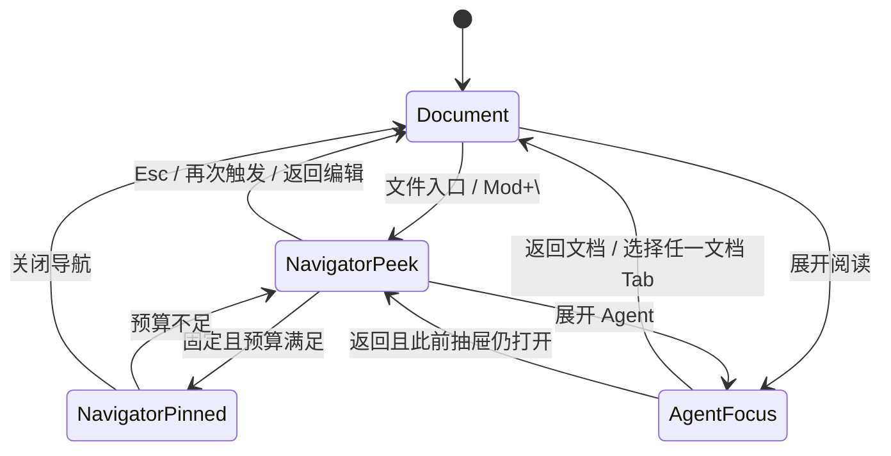

# Iris 自适应工作区规范

> 状态：v1.2.19 规划契约。版本排期以 [ROADMAP.md](../ROADMAP.md) 为准，通用视觉规则以 [design-system.md](./design-system.md) 为准。本文不描述已经交付的架构事实；实现完成后再同步 `ARCHITECTURE.md`。

## 1. 决策摘要

Iris 不采用永久“文件树 + 文档 + Agent”三栏。Markdown 文档是默认主平面，文件导航和 Agent 根据当前任务使用不同 presentation：

1. **写作**：文档 + Agent 侧车。
2. **浏览**：左侧文件抽屉覆盖出现，不压缩文档或 Agent。
3. **深度阅读 Agent**：Agent 临时占据主区，文档保持挂载。
4. **超宽窗口**：仅在宽度预算允许时固定文件导航。

这套模型解决两个独立问题：用户需要可见、可连续浏览的知识库空间地图；长 Agent 回答、表格和代码也需要超过传统聊天侧栏的阅读宽度。解决方案不得以牺牲正文行宽为代价。

## 2. 非目标

- 不恢复永久三栏作为默认布局。
- 不把 Agent 会话做成文档 Tab、Markdown 文件或新的持久对象。
- 不把管理中心完整 `VaultNavigatorBody` 原样嵌入主工作区。
- 不在轻量导航器中承载批量操作、语料库类型、模板、回收站管理或永久删除。
- 不新增 IPC、数据库表、migration、运行时依赖或专有笔记格式。
- 不修改 TipTap schema、Markdown parse/serialize 或正文保存语义。

## 3. 术语与状态

### 3.1 主平面

```ts
export type WorkspacePrimarySurface = "document" | "assistant_focus";
```

- `document`：默认状态，编辑器可见。
- `assistant_focus`：Agent 占据主工作区；编辑器不可见但仍挂载。

该状态仅存在于当前窗口内，不写入 SQLite，不跨应用启动恢复。

### 3.2 文件导航 presentation

```ts
export type NavigatorPresentation = "closed" | "peek" | "pinned";
```

- `closed`：只显示标题栏入口。
- `peek`：左侧浮动抽屉，不参与 flex/grid 宽度分配。
- `pinned`：宽屏固定面板，参与工作区宽度分配。

只持久化 `pinPreferred` 与目录展开集合；不持久化 `peek`、`closed` 或当前焦点。

### 3.3 Agent presentation

```ts
export type AssistantPresentation = "sidecar" | "collapsed" | "focus";
```

- `sidecar`：右侧协作侧车。
- `collapsed`：当前宽度不足以同时保护文档与 Agent，保留可见入口。
- `focus`：与 `WorkspacePrimarySurface = "assistant_focus"` 一致。

`aiPanelOpen` 表示用户是否希望侧车开启；presentation 是宽度预算计算出的有效显示结果。resize 不得覆盖用户意图。

## 4. 宽度预算

| 区域             | 约束                                                                                       |
| ---------------- | ------------------------------------------------------------------------------------------ |
| 文档保护宽度     | `52rem`，来自现有 `--prose-measure`                                                        |
| 文件导航固定宽度 | `18rem`                                                                                    |
| 文件导航浮动宽度 | `min(18rem, calc(100% - 3rem))`                                                            |
| Agent 最小宽度   | `25rem`                                                                                    |
| Agent 目标宽度   | `30rem`                                                                                    |
| Agent 最大宽度   | `45rem`                                                                                    |
| Agent 主区内容   | 消息流、确认区与 Composer 的内容容器最大 `70rem`（`--ai-focus-measure`），外层可占满工作区 |

宽度计算使用 AppShell 实际内容宽度，不使用 `window.innerWidth`。根字号变化时必须读取计算后的 `--prose-measure`，不得在业务逻辑中假定永远是 832px。

### 4.1 预算优先级

1. 文档保护宽度。
2. Agent 最小可读宽度。
3. 文件导航固定偏好。
4. Agent 用户保存宽度。

当预算不足时按以下顺序降级：

1. `pinned` 导航退回 `peek`。
2. Agent 宽度向最小值收缩。
3. 仍不足时 Agent 退为 `collapsed`，文档保持保护宽度。
4. 用户主动打开 Agent 时进入 `focus`；resize 本身不自动切换主平面。

### 4.2 固定资格

```text
shell content width
  >= document protected width
   + effective Agent sidecar width（若可见）
   + navigator pinned width
```

导航器已打开且 `pinPreferred = true` 时，满足资格即为 `pinned`；失去资格立即成为 `peek`，重新获得资格可恢复 `pinned`。用户关闭导航器后不得因 resize 自动重新打开。

## 5. 状态转换



### 5.1 重要转换规则

- 选择或新建文档时，如果主平面为 `assistant_focus`，先返回 `document`，再激活目标文档。
- 进入 `assistant_focus` 不关闭已打开的 `peek`；抽屉在 Agent 主区中保持隐藏，返回文档后恢复。
- 进入禅模式前保存导航与 Agent 用户意图；禅模式只改变有效 presentation，不覆盖偏好。
- 全局 Overlay、确认对话框和路径迁移对话框优先消费 Esc；只有没有更高层浮层时，Esc 才关闭 `peek` 或退出 `assistant_focus`。
- 切换 vault、退出应用或安装更新仍由现有持久化屏障决定；工作区 presentation 不得绕过屏障。

## 6. Workspace Navigator

### 6.1 入口

- 位置：桌面标题栏 traffic safe area 之后、Tab rail 之前。
- 图标：`FolderTree`。
- 可访问名称：关闭时“打开笔记库导航”，打开时“关闭笔记库导航”。
- 快捷键：`Ctrl/Cmd+\\`。
- 原 `Ctrl/Cmd+Shift+E` 保持打开管理中心的完整“浏览笔记库”。

### 6.2 内容结构

导航器使用真正的上下分层浏览器：

- 标题行仅居中承载“笔记库”分区名称，不重复展示快捷键或固定偏好控件。
- 上层是纯文件夹 tree，包含“根目录”节点与各目录直属 Markdown 数。点击目录名称只选择下层范围，箭头或左右键才展开/收起；按名称或直属笔记数独立排序。
- 下层只显示选中目录的直属文件，默认 Markdown；眼睛开关才包含直属图片、PDF、视频。它显示文件类型图标、用户可见标题和锁定状态，不显示绝对 vault 路径；按名称或更新时间独立排序。
- 上层 tree 与下层文件列表均为独立受限滚动视口；内容溢出时显示细滚动条，滚动不会撑高导航器、裁切条目或带动正文。
- 搜索输入框从下层工具栏展开，只匹配当前目录与当前媒体可见范围；切换目录、清空或 Esc 后收起。
- 当前文档、标签页或搜索结果外部切换时自动选择并展开其父目录；删除选中目录时逐级回退到最近存在父目录，最终回退根目录。
- 两层默认 `45/55`，中间水平分隔线可拖动、方向键按 5% 调整、双击复位，范围 `25%–70%`。比例、两层排序和媒体显示偏好可持久化；选中目录、展开集合和搜索词不持久化。

### 6.3 打开与预热

- 浮动抽屉使用 `--motion-base` / `--motion-exit` 的 opacity-only 进入与退出动效；退出期间不可交互且对读屏隐藏，动画结束后才卸载。不得使用 transform、宽度或正文位移动画；`prefers-reduced-motion` 下立即切换。
- 单击或 Enter 打开文件，但不关闭导航器，以支持连续浏览。
- hover/focus 使用现有 prepared-note 调度，source 保持 `file-tree`。
- 快速连续点击必须沿用现有 foreground open 顺序和 stale-result 防护。
- 媒体沿用现有 media tab 路由；不把媒体伪装为 Markdown。

### 6.4 文件操作

导航器允许：

- 在根目录或目标文件夹新建笔记。
- 新建文件夹。
- 重命名文件/文件夹。
- 移动文件/文件夹。
- 锁定/解锁 Markdown 文档。
- 移入回收站。

操作入口使用行尾 `…` 或右键 `IrisSurfaceMenu`；hover 不同时铺开四个 icon，避免树宽度被操作按钮占满。

所有路径变化必须复用：

- `useNavigatorFileLifecycle` 的 dirty flush、path migration 与 tab 替换。
- `fileRename` / `folderRename` 的无覆盖语义与索引降级回执。
- `ConfirmDialog` 与 `fileDelete` 的回收站语义。
- 同一提交回执对 Tab、活动路径、最近笔记、导航树和 editor surface 的更新。

### 6.5 管理中心边界

以下能力只保留在管理中心：

- 批量选择、批量移动、批量锁定和批量删除。
- 语料库类型与知识重建。
- 模板创建和模板编辑。
- 回收站恢复与永久删除。
- 文档恢复、版本追踪和其他审计入口。

## 7. Agent 主区阅读

### 7.1 入口与返回

- `AssistantPanelHeader` 右侧增加“展开阅读”icon + tooltip。
- 主区状态显示“返回文档”，不可显示为关闭会话。
- 点击任一普通/涉密/媒体文档 Tab、打开 Quick Open 结果或新建文档时返回文档主平面。
- 新建对话、切换历史会话和 Run 状态变化不退出主区阅读。

### 7.2 稳定挂载

AppShell 中只存在一个 Agent React 子树。切换 `sidecar ↔ focus` 只改变 sibling 的尺寸、可见性与布局属性，不在两个父节点之间条件移动 `aiPanel`，也不以不同 `key` 重建组件。

必须保持：

- 当前 session 与历史消息。
- Composer 草稿、mention、图片和逐 Run 外部只读授权选择。
- 流式 Run、确认、恢复与错误状态。
- 消息滚动位置与用户选择。

编辑器同样保持挂载；进入 focus 时使用不可交互、不可见但保留状态的布局，不调用 `ready(null)`，不重置正文 baseline。

### 7.3 排版

- 主区沿用 `data-prose-surface="conversation"`，不复制 Markdown 渲染器。
- 消息操作轨、assistant bubble、过程区和 citation footer 位于统一的最大 `70rem`（`--ai-focus-measure`）内容列内。
- Composer、外部工具授权边界和选中消息操作条与消息列同宽。
- 超宽窗口不得把助手段落铺满整个主区；代码块和表格继续在内容列内安全处理横向内容。`--ai-focus-measure` 是主区阅读专用 token，文档与侧车仍消费 `--prose-measure`（52rem）。

### 7.4 涉密与权限

- `classified` focus 仍绑定当前解锁文档视图，不改变易失会话策略。
- 退出 focus 不锁定涉密库；真正的锁定、超时和文档切换沿用现有 classified session 规则。
- focus 不改变 AI 写入确认、Run-local grant、联网授权或安全事件投影。

### 7.5 文档选区与 Agent 临时关联

- 文档与 Agent 默认解耦。仅当普通文档存在非空文字选区且 Agent presentation 可见时，才在 Composer 上方显示可撤销的「当前选区」候选；候选不是持久化引用，也不会因为打开文档、切换会话或浏览正文而自动产生。
- 选区更新时以最新范围替换旧候选；选区折叠、取消选择、切换文档或 Agent 隐藏时立即解除关联。Agent 重新显示时仅根据仍存在的当前非空选区重新校验，不恢复已取消或已发送的旧候选。
- 候选预览只保存在 renderer 内存，可显示截断文本和移除按钮；发送前必须完成现有磁盘签名、提交内容 hash 与 UTF-8 范围校验。候选未保存、来源变化或无法映射时显示原因并阻止发送，不自动保存或静默降级。
- 锁定的普通文档仍可选择和引用其已提交内容；锁定只影响编辑/剪贴板写入权限。classified 文档不建立此临时关联，继续遵循解锁、易失会话和一次性结果读取规则。
- 编辑器右键菜单只承担剪切、复制、粘贴、全选；锁定/只读时仅提供复制、全选。任何 AI 选区改写、翻译、检查或“发送到 AI”动作不得重新出现在编辑器右键菜单。

## 8. 焦点、键盘与可访问性

- 标题栏文件入口、导航树、固定按钮和 Agent 展开/返回按钮必须有 tooltip、可访问名称和可见焦点。
- `Ctrl/Cmd+\\` 从关闭状态打开导航后，焦点进入当前文件行；无当前文件时进入第一行。关闭后返回标题栏入口。
- 文件夹行用 `aria-expanded`；树容器/行采用正确的 `tree` / `treeitem` 层级与键盘语义。
- ↑/↓ 移动可见行，← 收起或到父级，→ 展开或到第一个子项，Enter 打开，Shift+F10/菜单键打开文件操作。
- Agent focus 激活后把焦点送到之前的 Agent 焦点位置；没有记录时送到消息流标题，而不是强制进入 Composer。
- `prefers-reduced-motion` 下抽屉与布局切换不做位移动画；普通模式使用 `--motion-base`，不得动画正文宽度导致长文抖动。

## 9. 数据、持久化与失败模式

- 新增的 localStorage 只保存 UI 偏好，不保存笔记标题、路径正文、会话内容或凭据。
- 展开目录集合以不可逆 vault identity/现有安全标识隔离；如果没有合适的非敏感 identity，则只保存在当前进程，不得持久化绝对路径。
- catalog 加载失败时抽屉保留壳层并显示可重试的安全错误，不关闭当前文档或 Agent。
- 外部文件 watcher 更新时刷新受影响节点，保持用户展开集合和当前文件显露，不全树闪烁。
- 索引降级显示弱警示，但 Markdown 操作成功仍视为成功；不得因索引失败回滚文件动作。

## 10. 验收入口

- 自动化与施工顺序：[v1.2.19 实施计划](./superpowers/plans/2026-07-31-v1.2.19-adaptive-workspace.md)
- 人工矩阵：[v1.2.19 自适应工作区清单](./testing/v1.2.19-adaptive-workspace-manual-checklist.md)
- 通用 UI 门禁：[Iris Rail Refresh Manual Checklist](./testing/iris-rail-refresh-manual-checklist.md)
