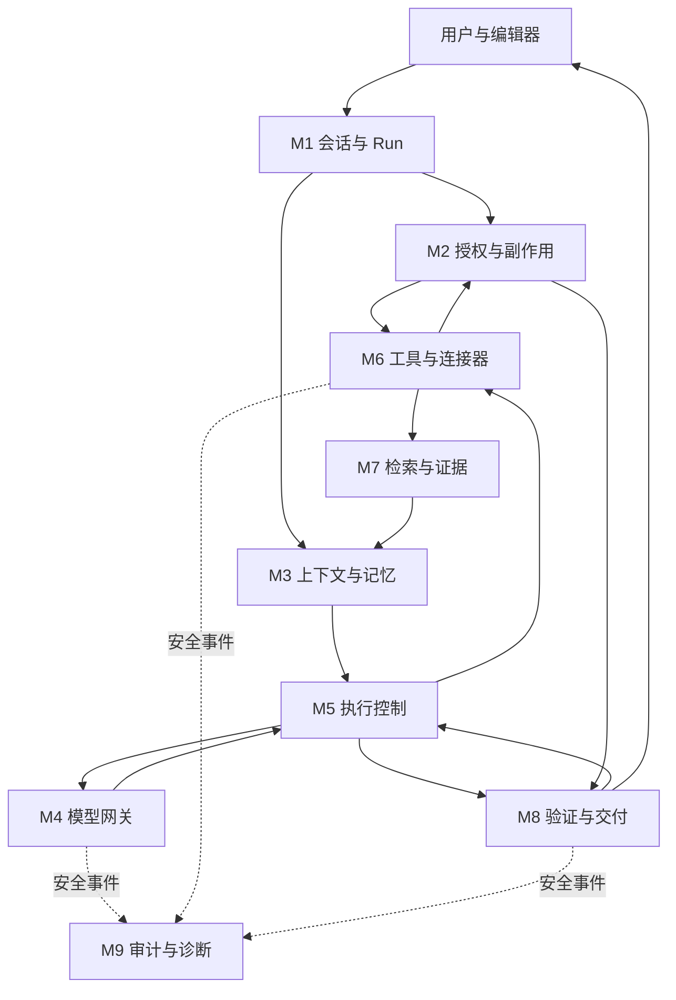

# Iris Agent 架构定义：模块、组件与工具边界

日期：2026-09-15

状态：目标架构定义。以下是本次明确的设计取舍，不是当前代码已经实现的声明，也不构成版本排期或发布验收。

依据：[讨论纪要](../AGENT-REFORM-DISCUSSION-2026-09-14.md)、[开发规范](../AGENTS.md) 与源码基线 `2670739f`。旧 Harness 体系已经归档，本文不继承其阶段完成度；历史入口仍由 [文档索引](./README.md) 管理。当前实现描述结合 [ARCHITECTURE.md](../ARCHITECTURE.md) 与源码核对。仓库仍规定 [ROADMAP.md](../ROADMAP.md) 承载版本排期，但其中旧 Agent 路线与归档阶段不能直接作为本次革新的执行依据；本文第 10 节明确迁移依赖与承接责任，不等待旧排期来决定技术先后，也不宣告旧文档整体废止或阶段已经完成。

## 1. 本次明确的结果及计数规则

**采用 9 个运行时模块、27 个逻辑组件；另设 1 套评测系统，包含 3 个组件。目标内置业务工具目录为 39 个，另保留 1 个按合同启用的结构化提交入口。外部 MCP 工具和供应商原生工具另计。**

这些数字由下文完整清单得出，不是从旧纪要的八行职责表直接继承，也不是普遍适用于所有 agent 的标准。

| 对象             | 本文的定义                                              | 数量                                      |
| ---------------- | ------------------------------------------------------- | ----------------------------------------- |
| 运行时模块       | 拥有一类稳定责任、状态权威与对外合同的逻辑边界          | 9                                         |
| 运行时组件       | 模块内可以清楚说明输入、输出、决定权和不变量的责任单元  | 27                                        |
| 评测系统         | 在生产执行之外评价合同和真实质量，不替 agent 在线作决定 | 1 套、3 个组件                            |
| 内置业务工具     | 可供模型提议、由 Iris 受控执行的命名动作；含可选委派    | 39：16 个通用能力目录项 + 23 个扩展目录项 |
| 结构化提交入口   | `submit_final_answer`，只在需要结构化结果的合同中暴露   | 1，不计作业务工具                         |
| Planned 占位项   | 当前目录有声明但未实现的项                              | 11，不纳入目标可执行工具数                |
| 外部 MCP 工具    | 已配置服务发现并获准暴露的额外工具                      | 动态数量 N，不计入 39                     |
| 原生搜索工具     | 供应商请求中的服务端工具声明                            | 按协议另计，不等同于 Iris 的 `web_search` |
| 一次任务的工具面 | 从目录与外部工具中按授权和上下文形成的具体集合          | 可变，不能用目录总量代替                  |

组件不是文件数、Rust `mod` 数、React 组件数或微服务数。一个组件可以复用多份现有代码；同一大文件中的不同责任也可以分别归属。本文不要求立即建立 27 个文件或新增 27 个抽象层。

模型是 M4 接入的外部能力，不另算一个内部模块。子 agent 是 C15 管理的子执行，复用同样的模块与合同，不复制一套内核。记忆归 M3，诊断归 M9，各有明确所有者。

## 2. 模块总览及为什么这样划分

| 模块 | 名称             | 组件          | 唯一主要责任                             |
| ---- | ---------------- | ------------- | ---------------------------------------- |
| M1   | 会话与 Run 管理  | C01–C03，3 个 | 请求身份、会话与运行状态、指令修订和取消 |
| M2   | 权限与受控副作用 | C04–C06，3 个 | 授权决定、冻结确认、实际变更执行         |
| M3   | 上下文与记忆     | C07–C09，3 个 | 模型本轮收到什么，以及历史与记忆如何覆盖 |
| M4   | 模型网关         | C10–C12，3 个 | 路由能力、协议续轮、调用结果与用量       |
| M5   | Agent 执行控制   | C13–C15，3 个 | 行动循环、资源预算、恢复与委派           |
| M6   | 工具与连接器     | C16–C18，3 个 | 工具合同、派发观察、MCP 传输             |
| M7   | 检索与证据       | C19–C22，4 个 | 本地检索、双路搜索、正文读取及来源事实   |
| M8   | 验证与交付       | C23–C25，3 个 | 任务验证、编辑候选、用户可见结果         |
| M9   | 审计与诊断       | C26–C27，2 个 | 安全关联记录与可解释的故障诊断           |
| 合计 | 运行时           | 27 个         | 不另加隐形调度器或通用审核 agent         |

这比原纪要的职责表更具体：

- 将运行生命周期从“请求和权限”中独立出来，避免一个状态字段同时表达授权、执行与任务成功。
- 权限与实际副作用放在同一模块下，但审批决定和执行回执是不同组件的输出。
- 将记忆纳入上下文模块，使裁剪、摘要覆盖与长期条目的使用有共同交接边界。
- 验证与交付独立于循环控制：验证报告说明还缺什么，循环决定继续还是结束，发布依据两者呈现实际结果。
- 诊断单独设模块，解决“跨越所有环节但没有明确所有者”的问题；它不控制业务执行。
- 检索中的双路协调先作为 C20，不另建一套研究引擎。协议适配归 M4，MCP 传输归 M6，搜索语义与结果组织归 M7。

## 3. 模块与组件合同

下列输入／输出名称是设计层逻辑合同，不是已经存在的 Rust 类型或 IPC 字段。现有文件是复用落点，不表示文件内全部行为都已经符合目标。

### M1 会话与 Run 管理

决定请求身份及运行生命周期，不按关键词替模型决定电影、法规等领域策略。执行状态与任务结果分开保存。

| 组件                   | 输入 → 输出                                                   | 决定权与不变量                                                                | 当前基础及处置                                                                                                                                                                                                                                            |
| ---------------------- | ------------------------------------------------------------- | ----------------------------------------------------------------------------- | --------------------------------------------------------------------------------------------------------------------------------------------------------------------------------------------------------------------------------------------------------- |
| C01 请求与引用绑定     | 用户消息、选区、目标文档、明确操作 → 请求身份与材料引用       | 绑定会话、Vault、文档版本和选区；显式授权事实不由模型推断；语义意图保持可修订 | [run_intake.rs](../src-tauri/src/ai_runtime/run_intake.rs)、[run_contract.rs](../src-tauri/src/ai_runtime/run_contract.rs)；复用身份合同，收窄领域预判                                                                                                    |
| C02 会话与运行状态     | 接受、执行、暂停、取消、结束事件 → 持久状态与安全恢复视图     | 唯一持久运行状态写入口；执行结束不等于用户任务成功；不能重放未知副作用        | [normal_session_repository.rs](../src-tauri/src/ai_runtime/normal_session_repository.rs)、[agent_run_repository.rs](../src-tauri/src/ai_runtime/agent_run_repository.rs)、[run_engine](../src-tauri/src/ai_runtime/run_engine/mod.rs)；复用并收清状态投影 |
| C03 指令修订与取消协调 | 后续用户指令、取消、确认反馈 → 带修订号的待处理输入或停止信号 | 旧修订产生的未发布答案不能覆盖新要求；取消后不启动新副作用                    | [run_inflight.rs](../src-tauri/src/ai_runtime/run_inflight.rs)、会话服务及 [对话 Hook](../src/components/ai/hooks/useAssistantConversation.ts)；取消有基础，运行中指令修订需补齐                                                                          |

本次选择：用户在运行中补充要求，先形成输入修订，在模型／工具交接安全点吸收；正在发生的外部调用可请求取消，其迟到结果保留为旧修订观察，不自动成为新答案。确认前目标或内容发生变化，使旧确认失效。对于不能撤销的已执行动作，只报告事实，不假装回滚。

### M2 权限与受控副作用

拥有授权真相。模型提出动作，M6 请求执行，M2 判定授权并管理必要确认。内容变化不被“允许联网”或“启用工具”隐含授权。

| 组件                 | 输入 → 输出                                                              | 决定权与不变量                                                                        | 当前基础及处置                                                                                                                                                                                                                                  |
| -------------------- | ------------------------------------------------------------------------ | ------------------------------------------------------------------------------------- | ----------------------------------------------------------------------------------------------------------------------------------------------------------------------------------------------------------------------------------------------- |
| C04 授权与外发策略   | 用户授权、数据域、文件范围、动作 → allow／deny／need-confirmation 与原因 | 控制读取、向模型发送、网页查询外发和写入；子任务和重试只能继承或收窄                  | [permission_decision.rs](../src-tauri/src/ai_runtime/permission_decision.rs)、[policy_decision_engine.rs](../src-tauri/src/ai_runtime/policy_decision_engine.rs)；复用，统一所有路线入口                                                        |
| C05 变更冻结与确认   | 候选变更、目标版本、已有授权 → 冻结变更及确认身份                        | 确认绑定目标、内容、范围、版本和有效期；已有有效授权不反复索要                        | [frozen_change_plan.rs](../src-tauri/src/ai_runtime/frozen_change_plan.rs)；复用，统一编辑候选交接                                                                                                                                              |
| C06 确定性副作用执行 | 通过确认与版本复验的操作 → 实际执行回执与部分失败                        | 只有此边界可提交 Agent 引起的副作用；调已有业务服务，保留已执行前缀，不由模型声明成功 | [tool_dispatch/markdown.rs](../src-tauri/src/ai_runtime/tool_dispatch/markdown.rs)、[vault.rs](../src-tauri/src/ai_runtime/tool_dispatch/vault.rs)、[note_operations.rs](../src-tauri/src/storage/note_operations.rs)；复用业务原语，整理写入口 |

C06 是 Agent 对副作用的统一协调边界，不接管编辑器等非 Agent 功能的全部文件保存。记忆、计划登记和导出也有副作用：C06 授权执行，具体存储逻辑仍由对应业务组件完成。

### M3 上下文与记忆

拥有上下文的内容选择和覆盖说明，不改写真实工具状态或代替权限决策。任务状态是结构化的工作信息，不等同于模型私有推理。

| 组件                   | 输入 → 输出                                                             | 决定权与不变量                                                             | 当前基础及处置                                                                                                                                                                                                             |
| ---------------------- | ----------------------------------------------------------------------- | -------------------------------------------------------------------------- | -------------------------------------------------------------------------------------------------------------------------------------------------------------------------------------------------------------------------- |
| C07 当前上下文装配     | 当前指令、授权材料、观察、技能方法 → 本轮上下文及覆盖清单               | 明确哪些内容被采用、裁剪、过期；为稳定指令和最新纠正保留空间               | [run_context.rs](../src-tauri/src/ai_runtime/run_context.rs)、[context_materials.rs](../src-tauri/src/ai_runtime/context_materials.rs)、[prompt_contract.rs](../src-tauri/src/ai_runtime/prompt_contract.rs)；整理现有装配 |
| C08 会话压缩与工作状态 | 历史区间、实际裁剪边界、当前任务事实 → 摘要覆盖与待办／撤回／已完成状态 | 被裁剪区间必须有可解释的覆盖或缺口；失败不能压成成功，旧纠正不能覆盖新纠正 | [conversation_memory.rs](../src-tauri/src/ai_runtime/conversation_memory.rs)；复用摘要，补覆盖一致性与任务状态                                                                                                             |
| C09 长期记忆           | 授权读写、作用域与版本 → 偏好／事实条目及变更回执                       | 与聊天摘要分离；同作用域保留更新关系；长期事实不自动当作当前网页证据       | [tool_dispatch/memory.rs](../src-tauri/src/ai_runtime/tool_dispatch/memory.rs)；复用存储，补条目来源与失效表达                                                                                                             |

本次选择：摘要与当前任务状态可由系统维护；跨会话长期记忆的持久修改沿用户确认合同，默认不把任意聊天内容自动写成长期事实。已保存偏好可在获准作用域自动取用。具体记忆管理界面的布局不属于此次定义。

### M4 模型网关

把实际供应商能力如实提供给上层；不因接口名相似丢弃必要续轮信息。主对话、摘要、语义验证和受控原生搜索请求都走这个边界，均向 C13 申领额度。

| 组件               | 输入 → 输出                                               | 决定权与不变量                                                                                             | 当前基础及处置                                                                                                                                                                   |
| ------------------ | --------------------------------------------------------- | ---------------------------------------------------------------------------------------------------------- | -------------------------------------------------------------------------------------------------------------------------------------------------------------------------------- |
| C10 能力与路由     | 模型配置、任务所需能力、已验证配置 → 可用路由及能力状态   | 区分 unsupported、available、temporarily-failed、unknown；不支持原生搜索不能淘汰正常文本／MCP 路由         | [provider_router.rs](../src-tauri/src/ai_runtime/provider_router.rs)、[capability_resolver.rs](../src-tauri/src/ai_runtime/capability_resolver.rs)；收清 Provider 与工具能力来源 |
| C11 协议与续轮适配 | 上下文、工具合同、续轮状态 → 供应商请求与标准化事件       | Chat Completions／Responses／Messages 各自保真；文本、工具增量、服务端搜索、引用及必要续轮字段不被静默丢弃 | [model_gateway](../src-tauri/src/ai_runtime/model_gateway.rs) 及其子文件；修正现有合同，原生事件适配需补齐                                                                       |
| C12 调用执行与用量 | 请求、额度租约、取消信号 → 响应／错误、实际用量与传输状态 | 区分空输出、协议错误、服务错误和取消；重试与用量挂到同一调用身份，不隐藏额外模型请求                       | 网关、[run_engine/providers.rs](../src-tauri/src/ai_runtime/run_engine/providers.rs)、[circuit_breaker.rs](../src-tauri/src/ai_runtime/circuit_breaker.rs)；统一执行报告         |

本次不选定新 SDK，不把 Python／Node 后端加入方案。当前选择是保留 Iris 的会话、权限、持久化和执行控制主体，优先重整薄弱的网关与交接合同，不整体迁走运行底座。成熟依赖可替换 C11／C12 等内部实现；若将来采用现成循环库，也只能承接 M5 内的受控执行，不得越过 M2 的权限或另建权威状态。依赖选择仍需协议与打包验证，不影响本次模块定稿。

原生搜索、客户端工具调用、流式输出及续轮能力分别声明。没有原生搜索但支持客户端工具调用的模型可正常使用 MCP；连客户端工具调用也不支持时，不能冒充完整 agent 兼容，应明确其纯文本能力范围。不会为了“无感”而将不支持的动作标记为成功。

### M5 Agent 执行控制

拥有循环过程和统一预算账本。模型负责语义计划和修正建议，控制器按授权、观察和验证结果决定哪些动作能继续执行。

| 组件               | 输入 → 输出                                                 | 决定权与不变量                                                                              | 当前基础及处置                                                                                                                                                                   |
| ------------------ | ----------------------------------------------------------- | ------------------------------------------------------------------------------------------- | -------------------------------------------------------------------------------------------------------------------------------------------------------------------------------- |
| C13 循环状态与预算 | Run 合同、动作申请、用量 → 执行阶段、额度租约、剩余资源     | 额度只有一个权威账本；派发、内部请求、token、时间和子任务分维度记录；类别耗尽不封死无关能力 | [agent_tool_loop.rs](../src-tauri/src/ai_runtime/agent_tool_loop.rs)、RunBudgetPolicy；复用有界循环并收清计数                                                                    |
| C14 行动与恢复协调 | 模型提议、观察、验证缺口 → 下一轮行动、修复反馈或结束理由   | 无效提议不当作执行；不给无信息增益的相同错误无限重试；结束必须对应真实原因                  | 当前循环、[run_engine/recovery.rs](../src-tauri/src/ai_runtime/run_engine/recovery.rs)；整理提前收束与反馈交接                                                                   |
| C15 子任务协调     | 独立任务、上下文引用、父级授权与额度 → 子运行及带来源的报告 | 一层委派、只读、授权交集；预算从父级总资源中显式分配；子报告不是未经验证的最终事实          | [subagent_coordinator.rs](../src-tauri/src/ai_runtime/subagent_coordinator.rs)、[run_tool_loop.rs](../src-tauri/src/ai_runtime/run_tool_loop.rs)；补参数消费、网页读取与真实报告 |

目标预算口径与当前父、子循环各自限额的做法不同：C13 保留父子层级明细，同时控制顶层总消耗，原生搜索辅助模型请求也纳入。数值先沿受控配置，不在本文凭直觉扩大；调整时必须兼容旧 Run 存档，旧确认不扩权。

**用户补充要求（2026-09-15）：Agent／Harness 必须具有实际的容错纠偏能力。未知工具、参数错误、搜索或抓取失败等可恢复问题，应记录到内部执行轨迹，提供修正反馈并继续尝试；不得因一次此类错误立即结束任务，或向用户提示“模型出错／模型能力降级”。**

容错由 C14 协调、C13 管预算、C17 交付错误观察、C26／C27 记录和解释，C25 依据恢复后的任务结果发布。这里记录的是可观察的动作、错误、反馈与修正轨迹，不依赖读取或保存模型私有思维链；无推理内容返回的模型也必须具备同样的恢复能力。

#### 可恢复错误的默认处理

| 情形                             | 反馈与纠偏动作                                                                                                                           | 不得发生的行为                                                                   |
| -------------------------------- | ---------------------------------------------------------------------------------------------------------------------------------------- | -------------------------------------------------------------------------------- |
| 提议不存在的工具                 | 返回 `unknown_tool`、本次未派发、工具面版本及相关合法工具的准确名称与 schema；让模型重新提议。若工具面或协议解析错位，先修正对应内部交接 | 一次未知工具即终止 Run；模糊匹配工具名后直接执行；把提议失败记成真实工具执行失败 |
| 工具存在但参数无效               | 返回字段级校验问题、允许类型及必要字段；让模型修正后重提                                                                                 | 只返回笼统 error；静默猜测写入目标或补造授权参数                                 |
| 超时、限流等暂时服务故障         | 在取消信号、服务退避提示与预算约束下重试；必要时使用已获准的等价服务路线                                                                 | 紧密无限重试；因一个工具服务失败就淘汰整个模型路由                               |
| 搜索无结果、范围偏离或证据不足   | 如实保留结果，向模型反馈缺口，由模型修改关键词、时间或地区约束，或改查来源                                                               | 把空结果当传输故障重复同一请求；让 Host 用关键词规则替模型编造查询语义           |
| 抓取失败、空正文或部分页面不可读 | 保留成功页面；对失败项按原因重试、使用获准提取回退，或让模型选择其他 URL／阅读窗口                                                       | 重新抓取全部成功页面；搜索摘要冒充已读正文；批次中一页失败导致整个任务失败       |
| 一条搜索路线失败                 | 保留另一条真实结果，修复失败路线或按证据充足性继续；同一搜索动作恢复时不重复伪造新双路成功                                               | 因原生失败丢弃 MCP 结果，或因 MCP 失败丢弃原生结果                               |
| 工具结果或交付候选未通过验证     | 返回具体缺口，让模型补查、修改候选或缩小结论；验证报告随新候选更新                                                                       | 校验失败立即改称模型能力降级；把旧候选的验证结果沿用到新候选                     |

错误观察必须以当前协议支持的有效工具结果或等价续轮消息反馈给模型，并正确关联原调用身份；不能只写日志而不给模型修正信息。无法安全还原工具调用身份时，由 C11／C14 按协议错误恢复，不能拼造一个表面有效但关联错误的工具返回。

#### 容错预算与停止条件

对可恢复的提议或调用错误，在授权仍有效、用户未取消且资源允许时，默认至少提供一次带具体反馈的纠偏机会。C13 在可调用工具的 Run 中为纠偏和最终表达预留资源，不能正常行动耗尽全部模型回合后才发现无法纠正；不足以满足该合同的配置应明确标为受限配置。

机械重试、模型重新提议和语义改查分开计数，全部纳入同一个顶层预算。未派发的无效提议不消耗“实际工具执行次数”，但它已经消耗的模型回合、token、时间及纠偏次数必须照实计入，不能形成免费无限循环。

相同错误反复出现时，C14 检查是否已提供有效反馈、工具面是否变化、参数或策略是否发生实质修正。具体次数与时限由受控恢复策略配置和评测校准；不能把“一次重复”直接等同于整个任务不可恢复。达到该路径的停滞阈值后停止该路径，仍检查其他获准行动与已有材料能否完成任务。

用户取消、明确权限拒绝、需要新增授权、不可恢复的配置问题，以及结果未知的非幂等副作用，不进入盲目自动重试。已执行或可能已执行的写入必须先核实回执，不能因重试造成重复变更。容错不能绕过网络开关、授权范围、费用和时间上限。

#### 用户表达与内部记录

内部保留“失败 → 具体反馈 → 修正提议／重试 → 恢复结果”的关联轨迹；首个失败不被后续成功覆盖。成功恢复并满足任务要求时，正常交付结果，不弹出模型降级提示；用户可在诊断详情查看恢复过程。恢复较久时可显示简短进度，但不将技术错误堆进正文。

只有仍影响任务交付、需要用户操作或恢复资源耗尽时，才在用户侧说明具体限制，例如“其中一个页面无法读取，以下结论基于其余来源”或“搜索服务暂时无法连接”。不使用“模型能力降级”概括工具调用错误；实际路由或能力变化必须有事实依据并独立记录。自动切换模型不作为未知工具或普通参数错误的默认纠偏手段。

### M6 工具与连接器

拥有工具合同和派发入口。工具名称是能力接口，不是权限。MCP 是这里的一种连接方式，不成为第二套独立执行系统。

| 组件                           | 输入 → 输出                                                              | 决定权与不变量                                                                                      | 当前基础及处置                                                                                                                                                                                                                           |
| ------------------------------ | ------------------------------------------------------------------------ | --------------------------------------------------------------------------------------------------- | ---------------------------------------------------------------------------------------------------------------------------------------------------------------------------------------------------------------------------------------- |
| C16 工具目录、工具面与技能接入 | 内置／外部 schema、能力状态、授权、上下文 → 版本化工具集合和方法材料引用 | Planned 不暴露；所有暴露参数必须消费或明确拒绝；技能不能增权；同一搜索服务不以原始别名绕开统一路径  | [tool_catalog_impl.rs](../src-tauri/src/ai_runtime/tool_catalog_impl.rs)、[tool_surface.rs](../src-tauri/src/ai_runtime/tool_surface.rs)、[skills](../src-tauri/src/ai_runtime/skills.rs)；复用并收清                                    |
| C17 调用派发与观察             | 工具提议、C04 决策、C13 租约 → 每次提议的派发状态及工具观察              | 分开 rejected／deferred／started／partial／failed／succeeded；分类计数由 C13 维护，C17 只申领并回报 | [tool_execution_pipeline.rs](../src-tauri/src/ai_runtime/tool_execution_pipeline.rs)、[tool_dispatch_impl.rs](../src-tauri/src/ai_runtime/tool_dispatch_impl.rs)、生产 executor；整合已有路径                                            |
| C18 MCP 连接与传输             | 冻结的服务配置、发现或调用请求 → transport 结果与服务能力                | 连接健康、工具发现成功和业务结果有效是不同事实；配置、超时、取消和密钥不绕开公共边界                | [mcp_host_runtime.rs](../src-tauri/src/ai_runtime/mcp_host_runtime.rs)、[mcp_runtime_registry.rs](../src-tauri/src/ai_runtime/mcp_runtime_registry.rs)、[mcp_external_tools.rs](../src-tauri/src/ai_runtime/mcp_external_tools.rs)；复用 |

工具面可以在同一授权范围内于下一轮更新，并记录新版本；更新只改变可用描述，不自动扩大权限。C16 管技能发现与方法选择，C07 决定如何把方法材料装入上下文。

### M7 检索与证据

拥有资料获取及来源事实；不根据渠道名称裁定真伪。只有可追踪的实际观察才能进入证据链。

| 组件                 | 输入 → 输出                                                     | 决定权与不变量                                                                       | 当前基础及处置                                                                                                                                                                 |
| -------------------- | --------------------------------------------------------------- | ------------------------------------------------------------------------------------ | ------------------------------------------------------------------------------------------------------------------------------------------------------------------------------ |
| C19 本地检索         | 查询、范围、授权 → 命中片段与检索诊断                           | FTS／向量／图等是内部策略；保持范围、版本与排名语义，不能悄悄扩大到全库              | [retrieval_broker](../src-tauri/src/ai_runtime/retrieval_broker.rs) 与子实现、[retrieval_scope.rs](../src-tauri/src/ai_runtime/retrieval_scope.rs)；复用                       |
| C20 双路网页搜索协调 | 模型提出的查询、外发批准、两路能力、额度 → 两路状态与合并线索   | 每次获准的新搜索，两条可用路线都真实执行；原生不支持时正常单 MCP；不能伪造另一侧结果 | 复用 [web_evidence_broker.rs](../src-tauri/src/ai_runtime/web_evidence_broker.rs) 和生产网页执行；双路协调是明确缺失、需新增的行为                                             |
| C21 网页读取与提取   | 任一路发现或直接提供的 URL、阅读窗口 → 正文窗口、完整性、失败项 | 可批量抓取；URL 安全校验；部分失败保留成功；搜索片段不冒充完整正文                   | 网页 broker、[web_reading.rs](../src-tauri/src/ai_runtime/run_tool_loop/web_reading.rs)；复用阅读与回退                                                                        |
| C22 证据与出处管理   | 本地／网页／外部观察、引用请求 → 来源身份、内容范围、证据关系   | 来源类型、可信度、独立性和支持关系分别表达；有 URL 不等于事实成立                    | [agent_evidence_repository.rs](../src-tauri/src/ai_runtime/agent_evidence_repository.rs)、[provenance.rs](../src-tauri/src/ai_runtime/provenance.rs)；补原生来源接入与质量表达 |

外部网页、MCP 返回值及检索到的笔记是资料，不是新的用户指令。C22 保留来源边界，C07 将其作为资料装配；其中要求改权限、泄露数据或调用其他工具的文字不能改变 C04 的授权事实。

### M8 验证与交付

拥有任务验证报告和用户可见结果，不拥有执行历史，也不能把模型的完成声明直接落为文件回执。

| 组件                   | 输入 → 输出                                                                             | 决定权与不变量                                                                      | 当前基础及处置                                                                                                                                                                                                            |
| ---------------------- | --------------------------------------------------------------------------------------- | ----------------------------------------------------------------------------------- | ------------------------------------------------------------------------------------------------------------------------------------------------------------------------------------------------------------------------- |
| C23 任务验证           | 原要求、候选答案／修改、来源与回执 → passed／failed／unknown／not-applicable 的逐项报告 | 机械不变量程序验证；语义支持可借模型但保留证据与不确定性；验证不直接开工具          | [final_answer_integrity.rs](../src-tauri/src/ai_runtime/final_answer_integrity.rs)、[final_answer_submission.rs](../src-tauri/src/ai_runtime/final_answer_submission.rs)、provenance 与变更校验；整合已有并补内容保持验证 |
| C24 编辑候选与差异     | 原始文本、目标版本、模型生成 → 候选文本、差异与适用范围                                 | 生成候选不等于写文件；格式整理必须保持正文信息及顺序，仅允许明确的编号变化          | [UnifiedAssistantPanel](../src/components/ai/UnifiedAssistantPanel.impl.tsx)、编辑 patch 合同与 Markdown 业务服务；复用绑定，补统一候选合同                                                                               |
| C25 最终发布与 UI 投影 | 验证报告、循环结束原因、执行回执 → 回答、候选、澄清或限制说明                           | completed／partial／blocked 等任务结果与 Run 生命周期分离；不支持原生搜索不显示降级 | [run_engine/finalization.rs](../src-tauri/src/ai_runtime/run_engine/finalization.rs)、[observer.rs](../src-tauri/src/ai_runtime/run_engine/observer.rs)、对话投影 Hook；统一交付                                          |

文本润色与风格满意度不能由确定性检查保证。格式整理则不同：C23 应比较保留的文本内容、顺序及链接目标等信息，允许的变化明确列出；无法证明内容保持时提供差异或说明，不能自动标记“未改内容”。纯正则空白整理器不等于这个合同已经实现。

### M9 审计与诊断

独立负责执行证据的可解释性，业务模块提供安全事件。它不保存第二套运行状态，不通过 AI 猜测代替事实。

**用户补充要求（2026-09-15）：内部错误审计必须覆盖模块、组件、工具和模型行为，并提供清晰直观的定位。诊断入口应让人一眼看到哪里出现了什么问题、影响了什么、是否恢复及判断依据，而不是只能翻日志猜测。此要求属于目标架构的必要能力。**

C26 负责事件覆盖、关联与记录完整性，C27 负责故障归因、诊断摘要和可下钻视图；各业务组件仍对自己的执行事实负责。模型行为纳入诊断对象，不因此新增第十个运行时模块。

| 组件               | 输入 → 输出                                                               | 决定权与不变量                                                     | 当前基础及处置                                                                                                                               |
| ------------------ | ------------------------------------------------------------------------- | ------------------------------------------------------------------ | -------------------------------------------------------------------------------------------------------------------------------------------- |
| C26 安全边界事件   | 各模块事件、调用身份与结构见证 → 可关联记录及持久化状态                   | 不记录密钥、笔记正文或私有推理；失败、重试、父子关系和修订号可关联 | [tool_audit.rs](../src-tauri/src/ai_runtime/tool_audit.rs)、[trace.rs](../src-tauri/src/ai_runtime/trace.rs)、循环诊断；补出站结构与完整关联 |
| C27 诊断查询与解释 | Run／调用 ID、C26 事件与权威状态 → 已知事实、直接失败、恢复结果、待证根因 | 不把恢复耗尽当根因；缺事件必须报告缺口，不能默认执行成功           | 当前安全查询与事件投影；新增跨边界诊断视图，复用持久化基础                                                                                   |

必要授权或变更回执无法持久化时，不执行新的持久副作用；可选诊断写入失败则记录可诊断性缺口，不自动抹掉已经取得的正确答案。审计失败与任务失败分别表达。

## 4. 状态所有权与交接

模块之间只通过上述合同交换事实与请求。下表中的逻辑对象不是新建数据库表的指令。

| 逻辑对象                    | 权威所有者 | 主要读取者     | 禁止行为                     |
| --------------------------- | ---------- | -------------- | ---------------------------- |
| 请求身份、指令修订          | M1         | 全部模块       | 迟到结果冒充最新请求         |
| Run 生命周期                | M1         | M5、M8、M9     | 用“进程结束”代替任务成功     |
| 授权与冻结确认              | M2         | M6、M7、M4、M5 | 其他模块自行增权             |
| 上下文与摘要覆盖            | M3         | M4、M5、M9     | 摘要修改真实动作结果         |
| Provider 续轮状态与用量事实 | M4         | M3、M5、M9     | 网关静默丢掉必要字段         |
| 额度配置、预留与累计        | M5         | M4、M6、M7     | 每层另算总账、重复扣费或漏记 |
| 工具面与派发观察            | M6         | M5、M3、M9     | 被拒绝的提议写成已执行       |
| 来源身份、阅读范围          | M7         | M3、M8、M9     | 搜索片段自动升级为正文证据   |
| 验证报告与交付结果          | M8         | M5、M1、UI     | 有引用就认定结论成立         |
| 边界关联与诊断缺口          | M9         | 诊断 UI、评测  | 哈希存在就声称信息完整       |

每个模型请求、工具调用和原生搜索子请求携带 Run ID、输入修订号、父调用 ID、尝试 ID；工具调用还记录工具面版本。C26 记录结构见证，原文仍留在受控会话或瞬时上下文中，不进入日志。

图中虚线仅举例，各模块均需提供相关安全事件。调用关系允许受控反馈，不允许反向写入别人的权威状态。

## 5. 双路搜索的具体定义

本次明确采用 **一个 Iris 搜索接口、两条内部执行路线、共同的按需正文读取**。不增加两个让主模型任选其一的搜索工具。

**决定来源：**用户明确要求两路都实际使用；原纪要尚未决定时间上是否并行。“默认并发、受约束时串行”是用户随后委托 Codex 明确架构时作出的工程选择，用于减少两条独立路线的等待时间，不追写成用户此前明确要求。两路实际执行是功能合同，是否并发是执行策略；适配测试可以调整后者而不撤回前者。

1. 主模型理解问题，提出 `web_search(query)`。纯润色、提供材料内的格式整理等不因联网开关打开就自动搜索；一旦执行新网页搜索，双路合同生效。明确需要当前核实但没有实际观察的答案，由 C23 返回缺口，C14 让模型继续行动。
2. C04 检查联网及查询外发权限。C20 根据 C10 的具体模型／端点能力冻结路线，并从 C13 申领资源。
3. MCP 路线经 C18 调用选定搜索服务。原生路线经 M4 发起仅携带获准查询和必要公共范围的独立原生搜索请求。原生检索可以使用当前所选模型的原生能力，但不转发整段私有笔记上下文。
4. 两路独立时默认并发；供应商或执行约束需要串行时仍执行两路，并记录实际时间。以供应商定义的实际搜索事件或能证明检索发生的结构化 grounding 元数据作为执行证据；单纯发出带工具声明的请求、模型自行生成 URL，都不算已搜。
5. 原生返回只有生成文字、没有上述可核实的检索凭据时，记录协议／结果不足；在预算内允许有依据的恢复，不能伪造“原生已成功”，也不能悄悄归成“模型不支持”。
6. C20 合并 URL、保留渠道来源和各自状态；相同 URL 不算两个独立信源。C22 保存线索。主模型判断相关性、矛盾、阅读需求，调用 `web_fetch(urls, startChar)`；两路 URL 都可直接读取。
7. C21 默认使用已配置 MCP 提取；保留当前获准的安全抓取回退。搜索与抓取故障分别记录，正文不足返回阅读窗口与完整性，不能将摘要包装成完整抓取。
8. C23 检查引用身份和应满足的核实条件；主模型综合事实，C25 发布答案和必要限制说明。

C20 的逻辑结果包含：请求身份、各路线的 supported／attempted／succeeded／failed 状态、候选来源、用量与不足说明。查询修改形成新的搜索动作；同修订内成功的同一动作可以复用，复用必须指向真实观察与时间，不能算作新的联网执行。

原生不支持时 MCP 单路是正常配置。原生临时失败而 MCP 足够时不强行警告；但诊断保留真实失败。双路都失败或缺少足够证据时如实表达限制。预算不足以启动已承诺的两条路线时，说明本次限制，不以单路结果冒充双路完成。

该选择将原生搜索从主对话协议中隔离为受控子请求，目的是可控制查询、关联结果与计费；它不属于子 agent，也不代替主模型的语义判断。供应商是否能稳定实现这份合同仍需逐个适配测试，本文不宣布 MiniMax、DeepSeek 或 Gemini 任一端点已通过。

结构化检索凭据用于证明供应商按其协议报告了检索，不是不可伪造的真值证明，也不证明返回内容正确或来源彼此独立。仍需核对请求身份、来源与正文支持关系。

### 5.1 配置与设置界面的端到端合同

这里的两路是 **M4 提供的模型原生搜索 + M6 接入的 MCP 搜索**，不是从 MCP 主备列表取两个候选。一个可用原生搜索端点加一个 MCP 搜索服务即可满足两类路线；MCP 列表内部的主备转移仍是同一路线的服务选择，不默认向全部 MCP 服务并发请求。

源码中 [resolve_web_search_provider_route](../src-tauri/src/ai_runtime/mcp_runtime_registry.rs) 只返回启用的 MCP 搜索候选，最多 3 个；不能据其候选数判断原生路线存在与否。[McpProfilesPanel](../src/components/ai/skills/McpProfilesPanel.tsx) 已读取完整候选数组并支持排序保存，但 [useAiSidecarBridge](../src/hooks/useAiSidecarBridge.ts) 只展示首项，管理中心单选变更又写入单元素数组。缺陷是两个设置入口的写入语义不一致，会丢失已有备用项；不是“整个前端从来只能配置一条路线”。

目标配置合同如下：

- 保留总联网开关；关闭时原生搜索、MCP 搜索和抓取均不得启动。开启后按任务及既有外发权限执行双路合同，不再要求用户勾选两次才能获得已承诺的两路行为。
- 原生能力由所选模型／端点及验证状态提供，界面显示支持、不支持、待验证或临时不可用；不得将供应商品牌或文本连通性等同于搜索支持。
- MCP 主服务和备用顺序只有一个编辑语义；简略入口可展示主服务，但更换主服务不能静默删除备用项。完整设置、简略设置、IPC 和持久配置必须往返一致。
- 原生能力配置、MCP 有序候选与抓取能力分别保存；C20 合成带配置版本的执行快照。提供方变化后的状态刷新、失败提示及运行中配置变更必须保持可追踪，不能由不同前端局部状态各自决定实际路线。
- 设置往返与生产入口验证必须覆盖“原生＋单 MCP”“原生不支持＋单 MCP”“MCP 主备切换”“两个设置入口交替保存”和“运行中关闭联网”。仅验证后端两个替身都被调用，不足以声明双路能力已接通。

上述配置合同由 C10、C16／C18、C20 与 C25 的设置及状态投影共同承担，不新增第十个模块。

## 6. 工具清单、数量与暴露规则

### 6.1 当前目录事实

对源码基线 `2670739f` 的 `collect_tool_catalog` 所引用七组定义逐项统计：

| 组       | Dispatchable | HarnessOnly | Planned |
| -------- | -----------: | ----------: | ------: |
| read     |            9 |           2 |       0 |
| vault    |            5 |           0 |       0 |
| web      |            2 |           0 |       0 |
| boundary |           11 |           0 |      11 |
| write    |            2 |           0 |       0 |
| root     |            8 |           0 |       0 |
| skills   |            1 |           0 |       0 |
| 合计     |           38 |           2 |      11 |

共 51 个内置目录项。这里的“可派发”是源码声明状态，不代表本次逐个实测其生产效果；不包含动态外部 MCP 与独立注入的结构化提交。统计依据：[组装入口](../src-tauri/src/ai_runtime/tool_catalog/groups.rs)、[目录状态与过滤](../src-tauri/src/ai_runtime/tool_catalog_impl.rs)。

### 6.2 目标通用能力目录：16 个

“通用”表示服务于本轮核心场景，并不代表每轮默认全开。工具参数及返回结构仍应按 C16 合同检查，目录项数量不能替代实现验收。

| 工具                    | 语义归属      | 目标合同与取舍                                                            |
| ----------------------- | ------------- | ------------------------------------------------------------------------- |
| `system_time_now`       | M6 → 系统时钟 | 读取时间与时区，不需要联网                                                |
| `app_context_read`      | M1 / M3       | 读取获准的当前应用上下文                                                  |
| `capabilities_read`     | M6            | 读取能力及申请同授权内工具面扩展；新增 request_tools 的目标合同需实现消费 |
| `skills_list`           | M6            | 发现技能方法，不自动获得执行权限                                          |
| `search_hybrid`         | M7            | 默认本地检索入口                                                          |
| `read_note`             | M6 / 文档服务 | 按范围与版本读取本地正文                                                  |
| `list_vault`            | M6 / 文档服务 | 路径与标题导航，遵守检索范围                                              |
| `get_outline`           | M6 / 文档服务 | 读取目标大纲                                                              |
| `get_backlinks`         | M6 / 文档服务 | 读取反向链接                                                              |
| `get_context_packets`   | M3 / M7       | 返回当前已获准材料索引，不再另读私有内容                                  |
| `web_search`            | M7            | 一次动作保证原生与 MCP 可用路线均实际搜索                                 |
| `web_fetch`             | M7            | 两路 URL 共用批量正文读取与窗口续读                                       |
| `memory_read`           | M3            | 读取获准作用域长期记忆                                                    |
| `memory_write`          | M2 → M3       | 确认后新增、修改或删除长期条目                                            |
| `insert_text_at_cursor` | M2 / M8       | 绑定插入点与版本；候选与实际应用分离                                      |
| `replace_selection`     | M2 / M8       | 绑定原文范围与版本；应用前确认                                            |

选区润色或新段落生成通常直接形成候选文本，无须新增“润色”“扩写”“缩写”“写入候选”等独立工具。实际写文件继续使用受控编辑动作。自动上下文压缩也不另暴露一个工具。

### 6.3 目标扩展能力目录：23 个

保留现有能力，不通过此次架构整理删除导入、导出、笔记管理等产品功能。扩展工具仅在任务需要、能力启用且授权满足时进入工具面。

| 工具                         | 语义归属      | 目标合同与取舍                                               |
| ---------------------------- | ------------- | ------------------------------------------------------------ |
| `git_read_status`            | M6 / Git 服务 | 仅在 Git 任务中暴露                                          |
| `git_read_diff`              | M6 / Git 服务 | 正文外发仍受文档策略约束                                     |
| `git_read_log`               | M6 / Git 服务 | 读取获准仓库历史                                             |
| `secret_exists`              | M6 / 凭据服务 | 仅查询存在性，不读明文，不向普通任务默认暴露                 |
| `fs_import_to_vault`         | M2 / 文档服务 | 已授权外部来源导入；覆盖需版本校验                           |
| `fs_export`                  | M2 / 导出服务 | 保留显式导出接口，沿统一变更边界                             |
| `fs_read_authorized_folder`  | M6 / 文件服务 | 读取明确授权的外部目录                                       |
| `fs_write_authorized_export` | M2 / 导出服务 | 保留兼容接口，与 fs_export 共用执行原语                      |
| `doc_normalize_markdown`     | M8            | 文本转换辅助；目标标为无文件写入的变换，不能替代内容保持验证 |
| `doc_extract_citations`      | M7 / M8       | 抽取候选引用，不自动认证事实                                 |
| `git_write_commit`           | M2 / Git 服务 | 显式任务与确认范围内执行                                     |
| `search_semantic`            | M7            | 显式语义检索扩展，不与默认混合搜索重复自动调用               |
| `search_keyword`             | M7            | 显式精确检索扩展                                             |
| `get_regulation`             | M7            | 领域扩展，退出普通任务默认工具面                             |
| `spawn_subagent`             | M5            | 受限只读委派；启用该能力时暴露                               |
| `scheduled_task_create`      | M2 / 计划服务 | 沿已有登记语义，不承诺后台自动执行                           |
| `scheduled_task_list`        | M6 / 计划服务 | 查询已登记任务                                               |
| `scheduled_task_delete`      | M2 / 计划服务 | 授权范围内删除登记                                           |
| `vault_create_note`          | M2 / 文档服务 | 确认目标与内容后新建                                         |
| `vault_rename_move`          | M2 / 文档服务 | 确认后重命名或移动                                           |
| `vault_delete_to_trash`      | M2 / 文档服务 | 确认后移入回收站                                             |
| `vault_asset_write`          | M2 / 文档服务 | 确认目标后写入资源                                           |
| `vault_version_list`         | M6 / 文档服务 | 读取获准版本列表                                             |

上述“保留”不表示保留错误权限分类或未消费参数。例如，当前 `doc_normalize_markdown` 处理器返回转换文本，目录却标有写权限；目标应按真实效果修正分类。它只做现有规范化，不能独立保证任意粘贴文章的内容保持。

`spawn_subagent` 的目标合同明确消费 `context_hint`；`max_rounds` 只能收窄 C13 分配的上限，不能提权。子任务网页核验应具备获准的 `web_fetch`；报告返回实际来源、未解决问题与用量，取消固定 50／75 的伪置信概率。

### 6.4 不进入业务工具数的项目

| 项目                                 | 本次决定                                                                            |
| ------------------------------------ | ----------------------------------------------------------------------------------- |
| `conclude_reasoning`                 | 从目标工具面退出，使用自然答案结束；兼容期仍需识别旧记录，不因此重放动作            |
| `submit_final_answer`                | 保留 1 个条件式协议入口；普通聊天、WebRequired 本身不强制用它                       |
| 原生 `web_search` 声明               | M4 内部协议能力，经 C20 管理；不作为第二个主模型可任选的 Iris 搜索工具              |
| AnySearch／Tavily 的 search／extract | 作为 `web_search`／`web_fetch` 的后端适配，不在同一次搜索任务中重复作为旁路工具暴露 |
| 外部 MCP 其他工具                    | 各自注册、验证与授权，计数 N 单独呈现，默认不接管受控写入                           |
| 未实现占位                           | 不向模型暴露，不因文档有名字就声明可用                                              |

当前 11 个 Planned 名称为：

- `fs_pick_file`
- `fs_pick_folder`
- `doc_convert`
- `doc_ocr`
- `doc_extract_pdf`
- `doc_extract_table`
- `doc_fix_links`
- `clipboard_write`
- `clipboard_read`
- `secret_create_update`
- `secret_read_plaintext`

其中 `secret_read_plaintext` 是明确禁止实现与暴露的能力，不是等待开发的计划。其余占位也没有被此次定义升级为新增功能任务。

### 6.5 每次任务究竟暴露多少工具

采用“基础工具 + 获准领域工具 + 显式扩展”的规则，不按电影、法律等关键词建立大量专门执行分类器。

| 场景／模式                   | 工具面规则                               | 数量解释                                           |
| ---------------------------- | ---------------------------------------- | -------------------------------------------------- |
| 显式仅处理提供文本的封闭任务 | 无工具，直接生成候选；不私自读取缺失文档 | 0；缺材料时说明需要什么                            |
| 普通助手对话                 | 时间、应用上下文、能力查询、技能列表     | 基础 4 个；无需工具时仍可直接回答                  |
| 对话允许网页检索             | 基础加搜索、抓取                         | 6 个；只有实际发起搜索才执行双路                   |
| 对话允许笔记库读取           | 基础加六个通用本地工具                   | 10 个；同时允许网页时 12 个                        |
| 获准使用长期记忆             | 按需要加 `memory_read`                   | 在上述基础加 1；自动注入已获准偏好不要求模型先调用 |
| 编辑应用或管理任务           | 按明确任务、目标与权限加入所需动作       | 只加需要的写工具，不开放全部变更能力               |
| 外部服务／领域／委派任务     | C16 按 C04 决策扩展工具面并记录版本      | 不能用固定 5–7 代表全部产品能力                    |

上表是工具可见数量，不是应当调用的数量；纯寒暄可以在有工具的路由中零调用完成。禁止把自然对话误锁进无工具模式，以致后续时间或时效问题没有可用能力。

对于当前面未包括、但在既有授权内的能力，采用 `capabilities_read` 的工具面申请合同：请求目标工具名，C16 与 C04 验证后在下一轮安装新版本工具面；不执行业务动作、不授予新权限。名称未知或权限不足返回明确原因。这个参数扩展属于目标设计，当前 schema 和执行器尚需同步实现，不能只写进描述。

涉及新权限时转入现有确认流程。工具目录扩展、授权变更和实际工具执行分别记录，不能一步混做。

因此：目标内置业务目录固定为 39；条件式提交另 1；某轮还可能有 N 个获准外部工具。不存在“所有运行永久最多 5–7 个工具”的设计，也不存在“39 个每轮全部暴露”的设计。

## 7. 典型任务如何贯穿模块

### 7.1 寒暄、时间、电影与追问

M1 保存连续会话与用户修订；M3 保留当前日期、地区约束和前文。寒暄可零工具回答，时间来自时钟工具；模型理解电影问题后调用搜索，M7 保障双路并返回实际线索，模型选页读取，M8 按时效、地域、相关性与来源检查。

用户纠正地区或片名时，M1 增加输入修订，M3 把纠正置于当前约束；旧地区材料仍是旧观察，不能被摘要改称新地区证据。失败时 M9 应能指出查询范围、两路执行、正文阅读、协议续轮或最后发布中的具体断点。

### 7.2 润色、扩缩写与新段落生成

M1 绑定选区与目标，M3 只补必要文风材料，模型生成，C24 输出候选及差异。已有授权文本足够时无需检索，也无需子 agent。用户选择应用后 C05 冻结并核验授权，C06 调现有笔记原语，C25 依据回执呈现。

### 7.3 格式整理且内容保持

先保存原始文本与允许变化集合，模型或辅助转换器给出候选。C23 核对正文信息、顺序、链接等；仅序号和表示结构所需的语法变化可在已约定范围内发生。不能机械忽略所有空白、标点或数字，否则可能把实质改动漏过。

检查不能确定时交付差异和不确定项，不自动写入，也不声称“内容完全未改”。这是复用编辑器转换与差异能力后仍需补齐的验证合同。

### 7.4 长对话与运行中补充

C08 使用实际裁剪边界压缩历史，保持当前目标、最新纠正、执行回执及未决项。会话摘要不复制完整网页证据；需要时按来源身份重新加载获准内容并检查时效。输入修订到来后，C03 在安全点协调模型与工具，C25 不发布已失效版本的最终答案。

本次不承诺普通研究 Run 在进程重启后从任意中间点续跑；保留已有安全会话恢复与受限变更检查点语义。未来扩大执行恢复能力需单独明确，不隐藏在“有记忆”这一名称里。

### 7.5 受限子任务

C15 为独立阅读或分析分配上下文、工具面和额度，子运行使用 M3–M8 同样的合同。父级获准联网并且子任务需要搜索时，同样经过 C20；子任务不能绕过原生／MCP 策略。父级综合前检查报告来源、缺口与用量，不因“由另一个 agent 得出”就视作独立事实。

## 8. 错误如何归属与验证

每个组件报告本边界可证明的事实，不声称自己能解释所有上游原因。定位能力按以下合同建设，不能以“已经有日志”替代。

### 8.1 统一定位：在哪里发现，哪里产生，证据是否足够

每项诊断分别记录**发现位置、已证实的故障来源、关联影响和归因状态**。例如 C17 拒绝了未知工具，表示错误在派发边界被发现，不代表派发器本身有缺陷；可能是模型提出了不存在的工具，也可能是网关拼装或工具面版本错位。

| 信息           | 必须能回答的问题                                                                            |
| -------------- | ------------------------------------------------------------------------------------------- |
| 运行与版本身份 | 哪个会话、Run、输入修订、父／子任务、模型回合、调用与尝试？使用了哪个工具面与协议适配版本？ |
| 定位对象       | 哪个 M 模块、C 组件、工具实例、MCP 服务或模型调用？内部工具名与外部服务别名分别标识。       |
| 失败事实       | 哪个阶段违反了什么合同，预期和实际状态是什么？使用稳定错误码及易懂说明。                    |
| 归因状态       | 已证实、疑似、无法归因，还是存在多个独立原因？证据指向何处，尚缺什么？                      |
| 影响与恢复     | 是局部失败、阻断后续、结果不完整还是没有影响最终交付？重试、改查、回退是否成功？            |
| 记录完整性     | 是否缺开始／结束事件、关联断裂、持久化失败，或进程中断后结果未知？                          |

错误码、发现组件和根因不是同一个字段。依赖关系与明确传播关系用于关联因果；时间上先出现的错误不能自动成为全部后续错误的根因。一个 Run 可以有多个独立问题，诊断摘要不能强行压成一个“首错”。

### 8.2 分类必须区分程序、服务与模型行为

| 类别                   | 典型情形                                                   | 归因边界                                                             |
| ---------------------- | ---------------------------------------------------------- | -------------------------------------------------------------------- |
| 内部实现或合同错误     | 上下文漏装、续轮字段丢失、状态投影错误、工具面版本不一致   | 定位责任组件及违反的合同，不统称模型能力不足                         |
| 外部服务或传输错误     | 超时、限流、鉴权失败、MCP 断连、供应商返回协议不符         | 保留具体服务与请求身份；鉴权失败还需排查配置，不能直接认定供应商故障 |
| 工具执行或结果错误     | 参数无效、派发失败、部分写入、抓取只有空正文               | 传输成功、工具执行成功、结果可用分别判断；参数错误的产生位置另查     |
| 模型行为与答案质量问题 | 提议未知工具、未遵守已送达约束、结论不受材料支持、回答偏题 | 记录具体可观察行为和核验依据，不以模型名称或另一模型一句评价定罪     |
| 预期限制与控制结果     | 用户取消、正常权限拒绝、能力不支持、额度耗尽               | 独立展示，不一律算程序错误；若限制配置或执行违反合同，再归入内部错误 |
| 诊断不足               | 事件缺失、资料不可重取、无法确认字段是否送达               | 明确标为未知或待证，不默认成功，也不把所有模块标成失败               |

判断模型本身出现问题前，应核对当前指令及材料的覆盖、实际出站请求结构、工具面版本、必要续轮字段和返回解析。出站结构见证只能证明结构及关联，不能单独证明语义材料完整、模型理解正确。机械可证的违规与语义判断分开展示；语义评估保留判据、来源和不确定性，支持授权人工复核，不输出未经校准的“模型责任概率”。

### 8.3 诊断呈现：摘要、路径、证据三层

诊断视图必须直接从对应回答或失败提示进入，自动关联本次 Run，无需用户先复制 ID 或检索日志。具体布局沿现有设计系统实现，此处固定信息与交互合同：

1. **首屏摘要**：用一句话指出主要失败点、实际影响和恢复状态，同时显示归因是否确定及诊断是否完整。已恢复的问题仍可查看，成功答案不因一次已恢复超时而被整体标红。
2. **执行路径**：按模块 → 组件 → 调用实例下钻，展示正常、运行中、失败、部分成功、已恢复、受阻、未执行及未知状态。父子任务、原生／MCP 两路和重试分支分别可见；状态同时使用文字和符号，不能只依赖颜色。
3. **依据详情**：查看安全错误码、时间与耗时、尝试次数、资源计数、前后交接状态、关联事件及缺失证据。将“本组件失败”和“受上游失败影响未执行”分开，避免整个后续路径都被误认成有 bug。

以下仅为目标呈现示例，不是已有运行结果：

> 局部失败，答案已交付。M7 检索与证据 → C21 网页读取 → web_fetch，第 2 个页面正文提取失败；另 2 页可用，后续核验采用其内容。已确定：读取结果不满足正文合同。待确认：站点限制还是提取服务问题。

对于“答偏了但调用都成功”的情况，首屏可显示“答案相关性未通过，执行链无已知机械故障；模型行为疑似，语义归因待复核”，不能仅因为所有请求成功就展示为全绿质量通过。

### 8.4 事件完整性、安全与审计自身故障

重要交接须有开始、终止或明确未知状态；每次失败和恢复保留因果关联，不能只记最后一次成功。进程崩溃来不及写终止事件时，由持久状态与缺口规则标识中断或结果未知，尤其不能自动重试未知副作用。

诊断数据默认仅用于本地内部查看，不自动上传。日志及诊断导出不包含密钥、笔记正文、完整模型请求或私有推理；模型返回的错误字符串、未知工具名和 URL 也需脱敏，不能直接当作安全文本记录。已有授权会话、候选与来源可通过受控引用在本地详情中按需核验，不复制进诊断日志；材料已删除或授权已撤回时如实说明不可核验。

审计写入失败必须通过独立的运行内健康状态或 UI 信号呈现，不能要求仅靠同一个已失效的日志通道报告自身失败。诊断查询失败不能伪装成“没有发现错误”。记录保留、清理及导出遵循独立权限与容量边界，清理后明确哪些历史运行已不可完整诊断。

### 8.5 现象到交接的定位映射

| 现象                       | 直接检查的交接       | 责任定位依据                                                         |
| -------------------------- | -------------------- | -------------------------------------------------------------------- |
| 追问遗漏最新纠正           | C03 → C07 → C11      | 指令修订、上下文覆盖、出站消息结构；确认字段到达后再评价模型行为     |
| 未知工具                   | C11 → C16 → C17      | 流式拼装后的调用身份、工具面版本及拒绝原因；原始名称不未经脱敏写日志 |
| 两路只执行了一路           | C10 → C20 → C12／C18 | 能力状态、资源预留、真实原生事件、MCP 请求和分路结果                 |
| 抓取成功但没有正文         | C18 → C21 → C22      | 传输成功、正文校验与阅读窗口分开记录                                 |
| 文件发生意外修改           | C24 → C05 → C06      | 候选、冻结范围、确认身份、版本与实际写入回执                         |
| 格式整理改变内容           | C24 → C23            | 原文与候选信息差异、允许变换、验证结果                               |
| 过早收束                   | C17／C23 → C14 → C13 | 被拒绝原因、验证缺口、相同失败是否有新反馈、各类剩余额度             |
| 只剩“能力降级”             | C12／C18／C23 → C25  | 原始错误类别与用户结果是否被错误合并                                 |
| 日志只有成功却无法解释行为 | 各边界 → C26 → C27   | 缺失关联或缺失事件明确标为诊断不足                                   |

审计只能把机械断点定位清楚。材料相关性、推荐偏好和复杂事实争议仍需语义评价，不能承诺每次都自动得到唯一根因。

### 8.6 可诊断性必须单独验证

评测系统除验证任务输出外，还要用已知故障检查诊断是否指向正确层级：覆盖每个模块的关键交接、工具适配的共同失败合同及特殊副作用路径、模型无效提议和答案质量负例。故障类型至少包括内部合同错误、外部失败、正常拒绝、失败后恢复、多路部分成功、多故障并存、事件缺失及审计存储故障。

每个案例同时检查定位对象、错误分类、归因状态、恢复与影响表达、关联路径及敏感信息隔离。模型质量问题还要检查是否把推断错误地显示成已证实根因。测试替身与故障注入用于检验机械归属，真实模型样例与人工抽检用于校准语义判断；二者不能互相冒充。

“审计可用”的必要结果是：已知故障能定位、传播关系能解释、恢复不会抹去原始失败、证据缺口能看见、正常限制不会被误报为 bug。不能只以日志行数或事件数量作为完成依据。

恢复能力需要独立的验收案例：先提议未知工具，再根据反馈正确调用并完成；参数错误后修正；搜索暂时失败后成功；单页抓取失败而其余页面仍可交付；重复无效提议在有界纠偏后停止该路径；取消／拒绝后不继续重试；写入回执未知时不重复执行。每例同时检查内部错误与恢复关联、实际资源计数，以及用户侧是否出现不应有的降级提示。

评测分别报告首试成功率、可恢复案例的最终完成率、额外耗时与调用成本、错误提示误报，以及越权或重复副作用。不能为了提高“最终成功率”忽略无限重试、费用失控或原始失败被隐藏；也不能把首试失败直接等同于产品任务失败。本次不凭空设统一容错百分比，恢复策略必须在这些约束下校准。

## 9. 独立评测系统：3 个组件

评测系统不是第十个运行时模块，不接管在线授权或最终答案。它读取 C26 的安全事件及经专门授权的测试材料。

| 组件           | 输入 → 输出                                           | 当前基础与目标                                                                                                                              |
| -------------- | ----------------------------------------------------- | ------------------------------------------------------------------------------------------------------------------------------------------- |
| E01 案例与判据 | 用户场景、失败案例、任务要求 → 固定输入与独立评分规则 | [agent_capacity_eval/contract.rs](../src-tauri/src/ai_runtime/agent_capacity_eval/contract.rs) 及 fixtures；补自然追问、编辑内容保持与负例  |
| E02 执行与重放 | 固定配置、测试输入、替身或真实服务 → 可比轨迹和用量   | [agent_capacity_eval/test_support.rs](../src-tauri/src/ai_runtime/agent_capacity_eval/test_support.rs) 与脚本；区分确定性合同和付费真实调用 |
| E03 评分与校准 | 输出、来源、预设判据与人工抽检 → 分项结果和已知盲点   | [agent_capacity_eval/verdict.rs](../src-tauri/src/ai_runtime/agent_capacity_eval/verdict.rs)；机械、组合、语义评价分开，校准自动评分        |

本文的组件合同必须能被相应边界测试验证，但“有测试”不等于产品质量已通过。模型／预算比较应有同期基线，子 agent 比较说明总成本与任务条件；测试数据中的重建话术不能冒称原始失败录音或逐字请求。

本次未设新的发布分数，也未执行实网产品验收。完整 lint／类型／代码测试与发布 CI 属于后续实际实现的验证，本次仅进行架构文档核对。

## 10. 哪些复用，哪些补齐，哪些真正新增

### 10.1 处置分类

27 个组件均有现有相关代码基础，因此不使用“27 个组件都要新建”或“恰好 4 个全新”这样的施工统计。职责归属与代码净新增数量不是一回事。

| 处置                           | 明确对象                                                                                                   |
| ------------------------------ | ---------------------------------------------------------------------------------------------------------- |
| 保留主要基础并收清接口         | 会话仓库、授权策略、冻结确认、笔记写入原语、MCP 传输、本地检索、正文读取、证据身份                         |
| 整理已有但分散的职责           | 上下文装配、工具面、预算、恢复、终态、工具审计与任务验证                                                   |
| 新增目标行为，复用原有组件基础 | 运行中输入修订、双路搜索协调、原生搜索事件接入、跨父子及原生请求的资源总账、出站结构诊断、完整内容保持验证 |
| 修正接口而非新增概念           | 子任务 context_hint／max_rounds、原生 unsupported 状态、工具真实副作用分类、能力查询的工具面申请           |
| 从默认运行面移除               | conclude_reasoning；领域工具及管理工具退出普通对话默认工具面；Planned 不暴露                               |
| 保留但不扩大承诺               | 已有计划工具只登记；普通 Run 不自动获得进程级续跑；子 agent 一层只读                                       |

现有 `normal_run_service`、`run_tool_loop` 等大文件会映射到多个责任组件。这是职责需要整理的证据，不是要求按表机械拆文件。未来迁移应删除被替代的重复判断，不能只在旧路径外再包一层。

### 10.2 复核确认的具体缺口

以下基于同一源码基线的静态核对，未执行本轮故障复现实验，不声明修复完成。问题身份使用稳定编号与符号定位，行号变化不改变问题含义；这些问题也不自动成为此前 MiniMax 对话故障的唯一根因。

| 编号与责任                          | 已确认的事实                                                                                                                                                                                                      | 影响边界与目标要求                                                                                                                                                                                                                                            |
| ----------------------------------- | ----------------------------------------------------------------------------------------------------------------------------------------------------------------------------------------------------------------- | ------------------------------------------------------------------------------------------------------------------------------------------------------------------------------------------------------------------------------------------------------------- |
| F01 设置写入冲突：C16／C18、C25     | MCP 面板保存完整有序候选，侧车桥接的 `setWebSearchProviderId` 写单元素数组；见第 5.1 节                                                                                                                           | 主服务变更可能删除备用项。统一设置写入语义，补两入口往返测试；与原生＋MCP 双路的能力来源分别处理                                                                                                                                                              |
| F02 空分母质量门：E01、E03          | [verdict.rs](../src-tauri/src/ai_runtime/agent_capacity_eval/verdict.rs) 的 `ratio_bps` 在分母为 0 时返回 10000；`aggregate_capacity_scorecard` 据此计算召回、引用和约束门                                        | 整组样本在相应维度没有要求时可显示满分和通过。目标区分适用、未覆盖和通过，并显示实际分母；要求验证该维度却没有样本时，不得作为质量证据放行                                                                                                                    |
| F03 流式终止原因丢失：C11、C23、C14 | [streaming.rs](../src-tauri/src/ai_runtime/model_gateway/streaming.rs) 的 Chat Completions 流式分支没有消费 `choices[0].finish_reason`，正常返回及一处尾缓冲早退写死 `stop`                                       | `length` 等异常终止不能可靠到达 [FinalAnswerIntegrity](../src-tauri/src/ai_runtime/final_answer_integrity.rs)，会绕过基于结束原因的恢复判断。须保留供应商终止事实，覆盖正常结束、长度截断、工具结束、尾事件及缺失终止事件；不能把截断工具调用当作完整动作执行 |
| F04 读取时修复并写库：C18、C04、C26 | [mcp_runtime_registry.rs](../src-tauri/src/ai_runtime/mcp_runtime_registry.rs) 的 `list_web_evidence_providers` 调用 `heal_legacy_search_result_limit_mappings`，为匹配的旧配置补字段，并 UPDATE 映射、哈希与时间 | 普通列举触发隐藏配置变更，可能使既有绑定或快照失效。目标将其移到明确的配置升级／保存边界，保留变更身份和兼容处理；查询保持只读，既有信任与快照不能随新哈希自动扩权                                                                                            |

F02 不能概括成“每个无要求用例都会拉高混合评测分数”：当前实现先汇总原子分子分母，并非逐用例百分比取平均；`atoms` 完全为空也会报错。缺陷是某个维度总分母为零却仍可标为满分通过。旧评测比较需保留原口径并标识版本，不能直接把零分母改为 0 分后冒充模型质量下降。

F03 的结论限于所核对的 Chat Completions 分支；同文件中的 Anthropic 状态机已有停止原因处理，Responses 也走独立路径，不能扩大成所有协议都忽略终止原因。

F04 的写库并没有被证明绕过所有漂移拒绝：[mcp_external_tools.rs](../src-tauri/src/ai_runtime/mcp_external_tools.rs) 仍比较绑定哈希与当前 provider 哈希，不一致时拒绝。静态证据支持“读取会改变配置，并可能触发原本正确的漂移拒绝”；是否已导致某次用户故障仍需关联运行证据。配置内容实际变化后重算哈希本身是必要的，问题在变更时机、可见性及已有绑定的处理。

### 10.3 迁移依赖与承接责任

架构定义需要说明哪些条件成立后才能替换现有路径，不能只给模块分类再把顺序交给旧 ROADMAP。下表是本次确定的依赖边界，不是工期、版本承诺或全量施工任务拆解；不沿用已归档的 HR 阶段完成度。

| 依赖单元                  | 主要责任                     | 先决条件与进入下一步的证据                                                                                                                                            |
| ------------------------- | ---------------------------- | --------------------------------------------------------------------------------------------------------------------------------------------------------------------- |
| D0 建立可信基线与最小诊断 | E01／E03、C26／C27           | 固定代码、配置与场景身份；处理 F02 的适用性表达，保留原评分基线；能追踪模型、工具及恢复交接。完整诊断界面可后续扩展，但不能先以不可定位的结果评价迁移成功             |
| D1 修正协议与有界纠偏     | C11／C12、C13／C14、C17／C23 | 依赖 D0 的证据口径；先覆盖 F03、未知工具纠正、参数修正和工具后续轮，证明停止原因与错误反馈到达正确边界，再将新循环路径作为默认                                        |
| D2 收清会话、权限与上下文 | C01–C09、C16、C24            | 依赖 D0，可与 D1 独立部分并行；证明最新输入、选区版本、摘要覆盖、权限与取消不失真，为长对话和编辑应用提供可信材料及授权                                               |
| D3 接通双路搜索完整链路   | C10／C18、C20–C22、C25       | 依赖 D1 的续轮与恢复，以及 D2 涉及的外发授权和取消边界；处理 F01、F04，将设置、配置、原生能力、搜索、抓取与诊断贯通。必须证明真实生产入口的两路执行和无原生时正常单路 |
| D4 贯通文档任务与最终交付 | C05／C06、C23–C25            | 依赖 D1、D2；验证候选差异、内容保持、确认版本、写入回执与最终表达。纯编辑不等待 D3；需要联网材料的组合任务再依赖 D3                                                   |
| D5 校准整体行为及可选委派 | C15、M9、E01–E03             | 基础对话、编辑与所需搜索链路已有对应证据后，验证父子预算和来源，再评价委派收益；完整诊断与真实任务评价贯穿各单元，不推迟到这里才开始                                  |

每条被替换路径由其表列组件的实现任务承担迁移与旧路径退役责任，跨组件变更必须指定一个主责组件及关联任务，不能由“评测平面”代替执行责任。此处明确责任边界，不虚构尚未创建的工单或负责人；实际施工记录需包含前置缺口、改动范围、回归证据和回退条件，并从文档索引进入。

迁移以可验证的完整交接为单位，保留可读取的历史会话与明确的配置版本；不得同时运行两套权威状态或镜像执行真实写入。切换或回退不能重放未知副作用，不能通过回退重新开放已拒绝的权限。只有新路径的输入、执行、结果和诊断合同都有证据后，才能移除被替代的判断；不能只增加一层包装后宣布某模块已经迁移。

版本归属和工期仍需另行校准，但不会阻塞以上依赖判断。新施工记录应据本节展开，而不是恢复旧 HR 编号、继承旧完成度，或依赖 ROADMAP 中过期的 Agent 描述推导顺序。

## 11. 本次已定与仍不作承诺的边界

**本次明确采用：**

- 9 个运行时模块、27 个组件，另 3 个评测组件；责任按第 3、4 节分配。
- 39 个目标内置业务工具，16 通用、23 扩展；1 个条件式提交另计，外部 MCP 动态计算。
- 记忆归 M3、诊断归 M9、子任务归 M5，模型不计内部模块。
- 单一 Iris 搜索接口保证两路执行，默认并行；主模型保留查询、相关性与补查的语义判断。
- 原生搜索通过隔离的受控请求接入，所有费用、权限和用量纳入共同边界。
- 纯提供材料变换不因联网开关开启而强制检索；实际新网页搜索遵守双路合同。
- 输入修订在安全点生效，候选生成与文件执行分离，已有授权不反复确认。
- 普通回答自然结束，严格结构化合同按需使用提交入口。
- 可恢复错误先反馈并纠偏；恢复过程保留在内部执行轨迹，用户表达依据最终交付情况，单次工具错误不触发模型能力降级提示。

**本次不把以下事项冒充为已解决：**

- 具体供应商／模型端点的原生搜索兼容与性能；
- 具体第三方协议库或整体 agent 框架的最终依赖选择；
- 新预算数值、费用上限、发布分数与版本排期；
- 每个组件未来对应多少 Rust 文件或 React 组件；
- 现有所有工具已正确工作，或此架构已通过真实用户任务验收。

这些限制不使模块清单失效：实现可以在明确合同内演进。若后续改变模块所有权、工具语义或用户权限边界，应更新本文并说明理由；不能在代码中悄悄形成另一份架构。
