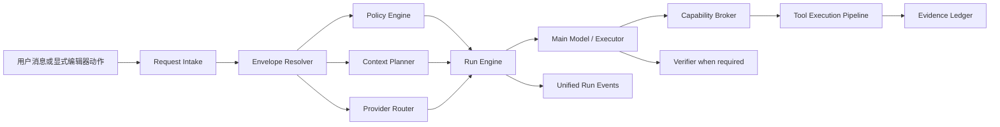

# 目标架构与执行路由规格

## 1. 架构原则

目标不是新增一个更大的路由器，而是取消互斥场景对执行权的控制。Harness 通过多个正交维度解析本轮边界，执行器只提供领域算法，不拥有独立生命周期、权限和持久化。



## 2. 组件职责

### Request Intake

- 校验 IPC Schema、会话归属、消息内容和显式引用。
- 为请求生成 `request_id`、`run_id`、`turn_id`。
- 立即持久化最小 accepted 事实并发出状态事件。
- 不读取当前编辑器状态。

### Envelope Resolver

- 解析用户显式约束、UI 动作、模态、联网语义、资料需要和预期效果。
- 使用确定性规则处理硬边界，不调用独立 LLM 场景分类器。
- 不选择旧 workflow；只产生执行约束和能力需求。

### Policy Engine

- 合并文档权限、安全域、工具效果、联网开关、Skill 声明和用户授权。
- 产生可执行能力集合、拒绝理由和待确认效果。
- 是所有工具和 executor 的唯一授权来源。

### Context Planner

- 只根据 Conversation、显式引用和已解析 material needs 组装上下文。
- 不读取当前文档或当前 tab。
- 控制来源配额、去重、token 预算和资料角色。

### Run Engine

- 拥有状态转换、预算、取消、暂停、恢复、事件序列和 checkpoint。
- 驱动主模型、工具轮、领域 executor、可选 verifier 和最终持久化。
- 所有领域逻辑共享同一 Run Engine。

### Capability Broker

- 将稳定能力名解析到内置工具或类型化 MCP/Web adapter。
- 不允许模型接触未经批准的原始 MCP 工具。

### Provider Router

- 按工具、视觉、上下文、推理、隐私和安全域要求选择候选。
- 只为实际 dispatch 的候选解密凭据。
- 按明确错误分类执行故障转移。

## 3. Execution Envelope

目标共享类型应表达以下语义；命名可按 Rust/TypeScript 规范调整，但字段不得退化回单一 intent：

```rust
pub(crate) struct ExecutionEnvelope {
    pub effect: Effect,
    pub context: ContextMode,
    pub freshness: Freshness,
    pub effort: Effort,
    pub security_domain: SecurityDomain,
    pub risk: RiskClass,
    pub modalities: Vec<Modality>,
    pub material_needs: Vec<MaterialNeed>,
    pub required_capabilities: Vec<CapabilityId>,
    pub explicit_constraints: Vec<Constraint>,
}
```

建议枚举：

```text
Effect       = answer | draft | apply
ContextMode  = none | conversation | explicit_references | explicit_scope
Freshness    = offline | web_preferred | web_required
Effort       = direct | tool_loop | durable
RiskClass    = read_only | bounded_write | destructive | external_side_effect
MaterialNeed = exemplar | authority | reference | web
```

`material_needs` 可组合。例如工作分析后形成公文可同时为 `authority + exemplar`。

## 4. 解析优先级

按以下优先级解析，同级冲突采用更严格边界：

1. 安全域硬限制和文档显式拒绝。
2. 用户本轮明确约束，如“只用本地”“不要修改文件”。
3. 显式编辑器动作携带的目标、选区和效果。
4. 本轮 `@` 引用和显式范围。
5. 对话中已明确且仍有效的目标与决策。
6. 产品默认值。

当前编辑器文档、活动 tab、光标位置和目录不是解析输入。

## 5. 路由规则

### 硬规则

- `web toggle = off` 必须解析为 `offline`。
- 用户明确需要最新、联网核实或给出 URL 时解析为 `web_required`。
- 联网开启且问题涉及外部可核验事实时至少为 `web_preferred`。
- 真实文件修改解析为 `apply + bounded_write`，但只有通过变更计划确认后才可执行。
- 小说写作默认 `context = conversation`、`material_needs = []`；不得自动改成 vault 检索。
- 公文起草默认增加 `exemplar`；只有涉及工作规则或用户明确要求时增加 `authority`。
- 工作分析涉及制度、流程、职责或合规时增加 `authority`。

### 不确定性

- 不确定是否需要某类材料时，优先给主模型一个受控只读能力，而不是先调用路由模型。
- 不确定领域会改变资料边界时，向用户提出一个简短问题。
- 禁止用宽松关键词直接触发 durable workflow 或写权限。

## 6. 执行升级

- `direct`：无需工具或只有已经提供的上下文；单主调用直接流式。
- `tool_loop`：主调用请求一个或多个只读能力；完成后继续同一 Run。
- `durable`：任务需要多个可恢复步骤、明确阶段产物或长时间运行。

只读的 `direct → tool_loop → durable` 可以自动升级并显示简短状态。任何升级都不能扩大安全域、文档范围或写入权限。

## 7. 状态机

```text
accepted → preparing → running
running → awaiting_confirmation → running
running → paused → running
running → verifying → completed
running/preparing/verifying → failed | cancelled
```

- 每次转换使用 `state_version` 做乐观并发控制。
- 重复 control 请求必须幂等。
- 非法转换返回稳定错误码，不修补状态继续运行。
- `completed`、`failed`、`cancelled` 是终态。
- 只有 `durable` 或等待确认的 Run 允许恢复。

## 8. Executor 合同

领域 executor 只能：

- 根据 envelope 和已授权上下文生成步骤或产物。
- 请求稳定 capability。
- 返回安全的 resume state 和验证要求。

领域 executor 不得：

- 自建数据库生命周期。
- 直接调用 Provider、Tool Dispatcher 或 IPC emitter。
- 修改权限决定。
- 读取当前编辑器状态。
- 将领域名写回为 Session scene。

## 9. 失败与降级

- 解析失败：回到最小能力的 direct answer，涉及边界时询问用户。
- Context 失败：说明未取得的资料，不伪造证据。
- Web 失败：`web_required` 不得无证据回答为已核实事实；`web_preferred` 可明确降级。
- Provider 瞬态失败：允许同能力故障转移。
- 权限拒绝：保留草案或只读结果，不重复弹窗。
- 持久化失败：不得对外宣称完成；写入事务必须回滚。
