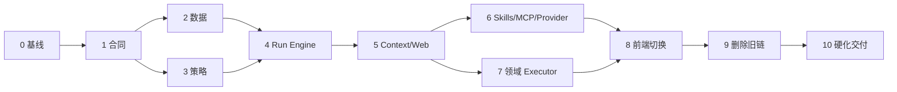

# 分阶段施工计划

## 1. 施工方法

- 严格测试先行：先写会失败的合同/复现测试，再实现最小行为。
- 每阶段只建立一种新事实源；禁止长期兼容层和双写。
- 在新链路达到退出条件前，不删除对应旧链路。
- 一旦开始最终切换，旧执行 IPC、前端路由和恢复入口必须在同一阶段删除。
- 每阶段结束都运行该阶段相关测试；最终阶段运行完整质量门禁。
- 未经用户允许禁止创建 worktree。

## 1.1 当前代码锚点与目标归属

下表用于帮助施工 AI 定位完整调用链，不要求机械照搬目标文件名；新增模块前仍须先搜索现有实现并证明无法复用。

| 当前热点                                                                                  | 主要问题                                       | 目标结果                                                              |
| ----------------------------------------------------------------------------------------- | ---------------------------------------------- | --------------------------------------------------------------------- |
| `commands/assistant_commands.rs`、`commands/ai_commands.rs`                               | 执行、确认、恢复、Session 与诊断 IPC 混杂      | 收敛到 run/session command 边界，command 只做 DTO、鉴权和调用应用服务 |
| `ai_harness/harness/run.rs`、`harness_task.rs`、`harness_confirm.rs`                      | 普通 Harness、兼容 task 和确认恢复多轨         | 唯一 Run Engine 和统一 control/state transition                       |
| `ai_runtime/task_plan.rs`、`agent_task.rs`、`trace.rs`                                    | intent/scene、task、trace 重复表达一次运行     | Execution Envelope + Run Repository 单一事实源                        |
| `ai_runtime/permission_decision.rs`、`agent_permissions.rs`、`tool_execution_pipeline.rs` | 文档、工具、grant 的范围语义未完全统一         | 一个 PolicyDecisionEngine，dispatch 前二次验证                        |
| `ai_runtime/session.rs`、`session_evidence.rs`、`classified_session.rs`                   | Session 文档绑定、证据重复、普通/涉密 DTO 分裂 | 文档解绑、统一逻辑 Repository、物理安全后端隔离                       |
| `ai_runtime/skills*`、`mcp_*`、`web_evidence_broker.rs`                                   | 激活误命中、同步准备和扩展边界分散             | 缓存 Skill Registry、类型化 Capability Broker、统一 Web evidence      |
| `ai_runtime/model_gateway*`、模型路由模块                                                 | Provider 差异和候选凭据可能泄漏到 Harness      | 能力路由与协议 adapter 分层、受控 failover                            |
| `ai_workflows/*`                                                                          | 各领域算法自带入口和状态                       | 保留算法，改为无生命周期 executor/capability；删除 research 产品路径  |
| `useAssistantTasks.ts`、`useAssistantHarnessResume.ts`、`assistant-taskplan.ts`           | 前端路由、重复 Context、双恢复                 | 单一 run controller、event reducer，无 scene/active note 输入         |
| `UnifiedAssistantPanel*`、确认与状态组件                                                  | 内部概念暴露、状态来源过多                     | 无感对话、简洁进度、可展开审计、业务化变更确认                        |

## 1.2 依赖顺序

阶段 2 与阶段 3 可以在合同稳定后分别施工，但接入阶段 4 前必须同时满足退出条件。其余阶段按依赖顺序推进。

## 2. 阶段 0：基线与 Characterization

### 目标

冻结重构前可观察行为，防止在没有证据时删除仍有价值的领域算法。

### 工作

- 为现有普通问答、公文、工作分析、小说显式引用、写确认、恢复、Web、Skill 和 Provider 建立 characterization tests。
- 记录当前简单问答从提交到 Provider dispatch、首事件和首 token 的阶段耗时。
- 建立旧数据库、旧 paused task、旧 evidence packets 和旧涉密 thread 的迁移 fixture。
- 对旧 IPC 和前端调用点生成可审查清单。

### 退出条件

- Fixture 能稳定复现当前重要数据形态。
- 性能基线可自动输出，不依赖人工计时。
- 旧入口清单与 Tauri 注册、Rust command、TS wrapper 和组件调用一致。

### 建议提交

`test(ai): 建立 Harness 重构前行为与迁移基线`

## 3. 阶段 1：共享合同与事件 Reducer

### 目标

先建立前后端共同语言，不连接生产执行。

### 工作

- 定义 ExecutionEnvelope、RunState、RunEvent、RunControl、EvidenceRef 和安全错误码。
- Rust 使用 `pub(crate)`；只有 IPC DTO 公开。
- 在 `src/types/ai.ts` 和 `src/lib/ipc.ts` 增加新接口类型封装。
- 编写纯前端 event reducer，覆盖重复、乱序、缺口、终态和重连。
- 为非法状态转换和 envelope 硬规则编写 Rust 单元测试。

### 禁止

- 不把新类型适配回旧 intent/scene。
- 不增加前端路由器。
- 不接管生产发送按钮。

### 退出条件

- Rust/TS Schema 字段和枚举一一对应。
- Reducer 可从 Event fixture 重建完整 UI 状态。
- 状态机属性测试证明终态不可离开、重复 control 幂等。

### 建议提交

`feat(ai): 定义统一 Run 与事件合同`

## 4. 阶段 2：数据迁移与 Repository

### 目标

建立新数据事实源，但生产执行仍可暂时走旧链路只读验证。

### 工作

- 按 [07-api-and-data-migration.md](./07-api-and-data-migration.md) 新增 up/down migration。
- 实现 Session、Run、Step、Event、Evidence Repository。
- 删除 Repository API 中的 scene/note_path/document_path 依赖。
- 实现 checkpoint Schema 校验和敏感字段拒绝。
- 实现普通域迁移 fixture、涉密文件惰性迁移 fixture 和故障恢复测试。

### 禁止

- 不开启新旧双写。
- 不迁移可执行的旧 raw checkpoint。
- 不在普通 SQLite 写涉密镜像。

### 退出条件

- Up/down/up 循环通过。
- 消息、标题和完成结果计数保持一致。
- running/paused 旧任务全部安全转成 cancelled_legacy。
- `PRAGMA foreign_key_check` 无结果。

### 建议提交

`refactor(storage): 迁移统一 Agent Run 数据模型`

## 5. 阶段 3：Policy Engine 与 Tool Pipeline

### 目标

在接入新 Run Engine 前，先建立不可绕过的权限内核。

### 工作

- 合并 ToolPolicy、permission preflight 和 document policy 的决定入口。
- 实现文档能力矩阵继承和资料角色安全解析。
- 修复 Session grant 的 scope 语义。
- 实现变更计划冻结、hash、过期和 dispatch 再验证。
- 让所有现有 Tool Dispatcher 通过统一 pipeline；先保留旧调用方。
- 将证据内容从 system 指令层移到明确的不可信 evidence/data 层。

### 退出条件

- 所有工具调用都能在审计中追溯同一 PolicyDecision。
- deny、网络关闭、涉密隔离和变更计划不一致测试全部阻断执行。
- 写工具不能并行，未分类工具默认拒绝或要求确认。

### 建议提交

`refactor(ai): 收敛文档与工具权限决策`

## 6. 阶段 4：Run Engine 最小纵切

### 目标

用新状态机跑通最小普通问答，不包含领域 executor。

### 工作

- 实现 Request Intake、accepted 持久化、Run Engine 和统一事件 emitter。
- 实现单主调用直答、流式内容、取消、终态事务和性能阶段埋点。
- 实现 `assistant_run_start/control/get`。
- 使用一个开发期入口或测试 harness 验证，不切生产 UI。
- Provider Router 返回候选并正确 hydrate 实际候选。

### 退出条件

- 简单问答只产生一个模型调用。
- accepted 先于 Context/Provider 耗时步骤可见。
- 取消可中断网络请求且不会补写 completed。
- 暖态/冷态 dispatch SLO 在 mock Provider 下达标。

### 建议提交

`feat(ai): 建立统一 Agent Run 最小执行链`

## 7. 阶段 5：Envelope、Context 与联网

### 目标

移除独立场景路由和重复 Context Assemble。

### 工作

- 实现确定性的 Envelope Resolver 和 material needs 规则。
- 后端单点组装 Conversation、显式引用和 material packets。
- 明确排除 active editor state。
- 接入 Web preferred/required、缓存、Evidence Ledger 和引用映射。
- 实现 Context 与 Provider route 的可安全并发。

### 退出条件

- 前端不再调用 `context_assemble`。
- 切换当前文档不改变请求 payload、检索范围和结果 fixture。
- 网络关闭调用为零，web_required 无证据时不伪装成功。
- 消息、Step 和 checkpoint 只保存 evidence IDs。

### 建议提交

`refactor(ai): 统一上下文解析与联网证据链`

## 8. 阶段 6：Skills、MCP 与 Provider 完整化

### 目标

把扩展能力收口到 Capability Broker，并移出关键路径。

### 工作

- 实现 Skill 注册缓存、精确激活、组合上限和 prompt 预算。
- 删除 legacy scene rerank、固定基础命中和运行时 no-op 声明。
- MCP 仅保留类型化 Web adapters，验证映射 Schema 和输出边界。
- 实现 MCP/Provider 健康缓存和允许的瞬态故障转移。
- 完成 OpenAI-compatible/Anthropic adapter 合同测试。

### 退出条件

- 普通问答不触发 Skill 扫描、embedding 或 MCP 诊断。
- 未映射 MCP 工具无法进入模型。
- Failover 候选凭据可用且错误分类正确。
- Skill 自动激活精度达到门槛。

### 建议提交

`refactor(ai): 收敛 Skill MCP 与 Provider 能力边界`

## 9. 阶段 7：领域 Executor

### 目标

将有价值的旧工作流算法改造成无生命周期的 executor。

### 工作

- 公文 executor：exemplar style blueprint、authority 内容约束和 patch preview。
- 工作分析 executor：多轮目标/假设/规范/方案摘要和冲突处理。
- 小说行为：强制无隐式仓库 Context，只接受显式引用或动作快照。
- 组织、引用检查、章节处理等算法作为 capability 或 executor step 复用。
- 不注册 Research executor；删除到 research workflow 的新路由。

### 退出条件

- 领域评测全部通过。
- Executor 没有直接 Provider/IPC/DB 生命周期调用。
- 混合“分析后写公文”能组合 authority + exemplar。
- 小说无 `@` 时 vault 工具调用为零。

### 建议提交

`refactor(ai): 迁移公文分析与创作领域执行器`

## 10. 阶段 8：前端切换与无感交互

### 目标

生产 AI 面板切换到唯一 Run 协议。

### 工作

- 发送按钮只调用 `assistant_run_start`。
- 使用统一 reducer 呈现流式内容、进度、确认、错误和重连。
- 默认隐藏内部工具/权限细节，提供可展开的运行详情。
- 变更确认展示目标、diff、影响和撤销，不展示工具 JSON。
- Session UI 删除当前文档绑定；Inline AI 显式构造 action snapshot。
- 删除研究控制 UI 和旧 resume 分流。

### 退出条件

- 所有 AI 面板 E2E 只观察到新 IPC/Event。
- 普通问答无设置或确认步骤。
- 切换编辑器不改变 Session。
- 断流后可通过 `assistant_run_get` 一致恢复。

### 建议提交

`refactor(ui): 切换统一 Agent Run 对话协议`

## 11. 阶段 9：一次性切断旧链路

### 目标

删除技术债，而不是把它藏成兼容层。

### 工作

- 删除 [07-api-and-data-migration.md](./07-api-and-data-migration.md) 列出的旧 IPC。
- 删除旧 intent/scene/TaskPlan 前端路由、旧恢复 hooks 和兼容 DTO。
- 删除 `ai_traces`、独立 Writing/Research/Deliberation runtime 代码路径。
- 删除旧 workflow facade 中已迁移逻辑；保留的算法移动到 executor/capability 模块。
- 清理 Tauri 注册、未使用类型、测试和文档引用。

### 退出条件

- `rg` 搜索不到旧 IPC 注册和生产调用。
- 无双写、无第二个 Run 状态机、无 Research executor。
- Clippy/ESLint 无 unused 或 compatibility warning。
- 完整迁移 fixture 和 E2E 通过。

### 建议提交

`refactor(ai): 删除旧 Harness 执行与恢复链路`

## 12. 阶段 10：硬化与交付

### 工作

- 执行完整安全、故障注入、性能和长会话测试。
- 核对日志和事件无正文、凭据与涉密泄漏。
- 更新 `ARCHITECTURE.md` 为已实现事实、IPC 文档、LLM routing、安全文档和 CHANGELOG。
- ROADMAP 只记录实际完成事实，不扩张版本承诺。
- 进行独立代码审查，逐项核对本目录完成定义。

### 退出条件

见 [09-verification-and-rollout.md](./09-verification-and-rollout.md) 的全部发布门槛。

### 建议提交

`docs(ai): 收口统一 Harness 架构与交付事实`
