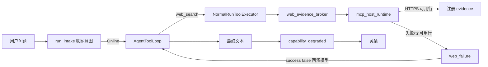

# 联网能力降级排查

当助手对话顶部出现 **「联网能力已降级」** 黄条时，表示本次 Run 曾尝试 `web.search` 但未注册任何网页证据，且 Run 仍以 `completed` 结束（非终态）。本文说明如何把问题定位到 **MCP/网络传输**、**Agent harness** 或 **LLM 模型** 三个故障域之一。

相关实现与契约见 [llm-routing.md](../llm-routing.md)、[design-system.md](../design-system.md)（`capability_degraded` UI）。

## 故障域与数据流



要点：

- 黄条触发条件同时满足：`web_failure` 存在、未注册 web evidence、本 Run 尚未发过 `capability_degraded`（一次性）。
- 无「证据是否足以回答」的 LLM 语义校验；门禁仅为至少一条 **HTTPS + 非空摘录**。
- **黄条 + 正文高置信编造**（如未来赛事具体比分）多为 **LLM 域**：工具失败 JSON 已回灌，但模型未遵守 system 约束。

## 步骤 1：抓取降级事件载荷

事件持久化在 `agent_run_events`（`event_type = 'capability_degraded'`），`payload_json` 含 `code`、`retryable`、`attemptCount`、`message`（camelCase）。

**推荐：诊断脚本**

```bash
node scripts/diagnose-web-capability-degradation.mjs
node scripts/diagnose-web-capability-degradation.mjs --run-id <run_id>
node scripts/diagnose-web-capability-degradation.mjs --db /path/to/iris.db
```

**手工 SQL**（库路径一般为 `IRIS_DATA_DIR/iris.db` 或 macOS `~/Library/Application Support/com.iris.notes/app-data/iris.db`）：

```sql
SELECT run_id, event_seq, created_at,
  json_extract(payload_json, '$.code') AS code,
  json_extract(payload_json, '$.retryable') AS retryable,
  json_extract(payload_json, '$.attemptCount') AS attempt_count,
  json_extract(payload_json, '$.message') AS message
FROM agent_run_events
WHERE event_type = 'capability_degraded'
ORDER BY created_at DESC
LIMIT 20;
```

前端重放：`assistantRunGet` → `replayAssistantRunEvents`（[`useAssistantRun.ts`](../../src/hooks/useAssistantRun.ts)）。对话内黄条可展开 **排查信息** 查看 `code` / `attemptCount`（无需查库）。

`code` 由 [`run_tool_loop.rs`](../../src-tauri/src/ai_runtime/run_tool_loop.rs) 中 `classify_web_failure` 映射，是分流的第一把钥匙。

## 步骤 2：按 code 分流

| code                                 | 故障域  | 含义                     | 下一步                                      |
| ------------------------------------ | ------- | ------------------------ | ------------------------------------------- |
| `agent_run_web_provider_auth_failed` | MCP     | API Key 无效/缺失        | 步骤 3：凭据 + 实时诊断                     |
| `agent_run_web_provider_timeout`     | MCP     | Run 预算内 MCP 超时      | 步骤 3：网络 + 诊断 + `web_duration_bucket` |
| `agent_run_web_provider_failed`      | MCP     | 传输/限流/配额等         | 步骤 3：健康表 + 诊断                       |
| `agent_run_web_evidence_invalid`     | MCP     | 无可用 HTTPS 行或摘录空  | 步骤 3：`searchResultParseLive`             |
| `agent_run_mcp_unavailable`          | MCP     | 无可用搜索映射/提供方    | 步骤 3：提供方与映射                        |
| `agent_run_web_evidence_required`    | Harness | 循环级 Err（通常无黄条） | 红色 `failed` 终态                          |
| 黄条存在 + 正文编造                  | LLM     | 工具失败已回灌仍编造     | 步骤 5                                      |

前端映射逻辑：[`web-capability-degradation-triage.ts`](../../src/lib/web-capability-degradation-triage.ts)。

## 步骤 3：MCP / 网络域

1. **管理中心** → **联网与证据** → 进入 MCP 提供方 → **实时诊断**（`webEvidenceProviderDiagnostics` → [`ai_commands.rs`](../../src-tauri/src/commands/ai_commands.rs)）。
   - 重点 check：`credential`、`liveConnection`、`searchToolLive`、`searchSmokeLive`、`searchResultParseLive`。
2. **Provider 健康表**（不驱动内存熔断，但记录最近失败）：

```sql
SELECT provider_id, consecutive_failures, last_failure_code, latency_ewma_ms, updated_at
FROM web_evidence_provider_health
ORDER BY updated_at DESC;
```

3. **`canEnable` 误判**：[`web-search-provider-state.ts`](../../src/lib/web-search-provider-state.ts) 仅看 `enabled && hasSearchMapping`，**不读**实时诊断、熔断或凭据。开关能开 ≠ 运行时一定能搜。

## 步骤 4：Harness 域

- **内存熔断**（[`circuit_breaker.rs`](../../src-tauri/src/ai_runtime/circuit_breaker.rs)）：连续 5 次瞬时失败打开，冷却 30s；**重启进程即清空**，偶发问题需在当次会话抓日志。
- **重试**：Run 内 `web_search` 最多 **2** 次，瞬态失败间隔 **250ms**（[`run_tool_loop.rs`](../../src-tauri/src/ai_runtime/run_tool_loop.rs)）。`attemptCount` 反映已用次数。
- **黄条是否应出现**：对照 `web_failure`、`!has_web_evidence`、`emit_deferred_web_degradation`（[`run_engine.rs`](../../src-tauri/src/ai_runtime/run_engine.rs)）。

## 步骤 5：LLM 域

1. 该 Run 是否出现 `tool_started` / `tool_completed` 且 `capability = web_search`（诊断脚本 `--run-id`）。
2. 若无工具事件：检查 intake 分类（[`run_intake.rs`](../../src-tauri/src/ai_runtime/run_intake.rs)）或模型未调用搜索；日志 **「Run Web decision」**（`web_mode`, `web_reason`）。
3. 若工具 `success: false` 但正文仍给具体「当前事实」：system 约束在 [`run_context.rs`](../../src-tauri/src/ai_runtime/run_context.rs)（`If web_search fails, ... do not invent current facts`），**无代码层终局拦截**。

## 步骤 6：Tracing 日志检索

无统一 span 名；用固定 message + 结构化字段：

| message                                    | 位置                    | 字段                                                                            |
| ------------------------------------------ | ----------------------- | ------------------------------------------------------------------------------- |
| `Run Web decision`                         | `normal_run_service.rs` | `web_mode`, `web_reason`, `web_execution`                                       |
| `Run model-decided Web capability outcome` | `run_tool_loop.rs`      | `web_failure_code`, `web_retryable`, `web_attempt_count`, `web_duration_bucket` |
| `Agent Run finalization stage failed`      | `run_engine.rs`         | `stage`, `safe_code`                                                            |
| 熔断开/关                                  | `circuit_breaker.rs`    | `provider`, `failures`, `cooldown_secs`                                         |

`web_duration_bucket`：`not_started` / `under_1s` / `1s_to_3s` / `3s_to_10s` / `budget_exhausted`。

## 可选增强（未默认开启）

- 熔断状态写入 MCP 诊断面板（当前仅进程内）。
- `canEnable` 与运行时可用性对齐（`provider_unavailable` reason）。
- 终局答复对「无证据 + 时效性问题」的轻量校验。

## 相关命令

```bash
npm run diagnose:web-degradation
npm run diagnose:web-degradation -- --run-id <run_id>
```
