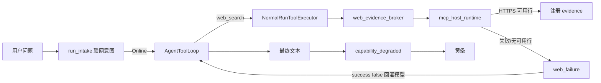

# 联网能力降级排查

当助手对话顶部出现 **「联网能力已降级」** 黄条时，表示本次 Run 曾尝试 `web.search` 但未注册任何网页证据，且 Run 仍以 `completed` 提交了回复。`completed` 是生命周期终态，不代表检索或事实质量验收通过。本文说明如何把问题定位到 **MCP/网络传输**、**Agent harness** 或 **LLM 模型** 三个故障域之一。

相关实现与契约见 [llm-routing.md](../llm-routing.md)、[design-system.md](../design-system.md)（`capability_degraded` UI）。

## 故障域与数据流



要点：

- 黄条触发条件同时满足：`web_failure` 存在、未注册 web evidence、本 Run 尚未发过 `capability_degraded`（一次性）。
- 无「证据是否足以回答」的 LLM 语义校验；门禁仅为至少一条 **HTTPS + 非空摘录**。
- **黄条 + 正文高置信编造**（如未来赛事具体比分）多为 **LLM 域**：工具失败 JSON 已回灌，但模型未遵守 system 约束。

## 步骤 1：抓取降级事件载荷

事件持久化在 `agent_run_events`（`event_type = 'capability_degraded'`），`payload_json` 含 `code`、`retryable`、`attemptCount`、`message`（camelCase）。

**推荐：诊断脚本**

```bash
node scripts/diagnose-web-capability-degradation.mjs
node scripts/diagnose-web-capability-degradation.mjs --run-id <run_id>
node scripts/diagnose-web-capability-degradation.mjs --db /path/to/iris.db
```

**手工 SQL**（库路径一般为 `IRIS_DATA_DIR/iris.db` 或 macOS `~/Library/Application Support/com.iris.notes/app-data/iris.db`）：

```sql
SELECT run_id, event_seq, created_at,
  json_extract(payload_json, '$.code') AS code,
  json_extract(payload_json, '$.retryable') AS retryable,
  json_extract(payload_json, '$.attemptCount') AS attempt_count,
  json_extract(payload_json, '$.message') AS message
FROM agent_run_events
WHERE event_type = 'capability_degraded'
ORDER BY created_at DESC
LIMIT 20;
```

前端重放：`assistantRunGet` → `replayAssistantRunEvents`（[`useAssistantRun.ts`](../../src/hooks/useAssistantRun.ts)）。对话内黄条可展开 **排查信息** 查看 `code` / `attemptCount`（无需查库）。

`code` 由 [`run_tool_loop.rs`](../../src-tauri/src/ai_runtime/run_tool_loop.rs) 中 `classify_web_failure` 映射，是分流的第一把钥匙。

## 步骤 2：按 code 分流

| code                                 | 故障域  | 含义                     | 下一步                                      |
| ------------------------------------ | ------- | ------------------------ | ------------------------------------------- |
| `agent_run_web_provider_auth_failed` | MCP     | API Key 无效/缺失        | 步骤 3：凭据 + 实时诊断                     |
| `agent_run_web_provider_timeout`     | MCP     | Run 预算内 MCP 超时      | 步骤 3：网络 + 诊断 + `web_duration_bucket` |
| `agent_run_web_provider_failed`      | MCP     | 传输/限流/配额等         | 步骤 3：健康表 + 诊断                       |
| `agent_run_web_evidence_invalid`     | MCP     | 无可用 HTTPS 行或摘录空  | 步骤 3：`searchResultParseLive`             |
| `agent_run_mcp_unavailable`          | MCP     | 无可用搜索映射/提供方    | 步骤 3：提供方与映射                        |
| `agent_run_web_evidence_required`    | Harness | 循环级 Err（通常无黄条） | 红色 `failed` 终态                          |
| 黄条存在 + 正文编造                  | LLM     | 工具失败已回灌仍编造     | 步骤 5                                      |

前端映射逻辑：[`web-capability-degradation-triage.ts`](../../src/lib/web-capability-degradation-triage.ts)。

## 步骤 3：MCP / 网络域

1. **管理中心** → **联网与证据** → 进入 MCP 提供方 → **实时诊断**（`webEvidenceProviderDiagnostics` → [`ai_commands.rs`](../../src-tauri/src/commands/ai_commands.rs)）。
   - 重点 check：`credential`、`liveConnection`、`searchToolLive`、`searchSmokeLive`、`searchResultParseLive`。
2. **Provider 健康表**（不驱动内存熔断，但记录最近失败）：

```sql
SELECT provider_id, consecutive_failures, last_failure_code, latency_ewma_ms, updated_at
FROM web_evidence_provider_health
ORDER BY updated_at DESC;
```

3. **`canEnable` 误判**：[`web-search-provider-state.ts`](../../src/lib/web-search-provider-state.ts) 仅看 `enabled && hasSearchMapping`，**不读**实时诊断、熔断或凭据。开关能开 ≠ 运行时一定能搜。

## 步骤 4：Harness 域

`--run-id` 现在同时读取冻结的 `freshness`/`webReason` 和 `provider_route_summary_json.toolLoop`，并使用 SQLite 只读连接。先检查 `proposals`、`rejectedProposals`、`firstRejection`、`dispatched`、`lastSearch`/`lastFetch`、`repairRounds` 与 `exit`：模型提议、派发、Broker 结果是不同事实。事件明细最多 12 项；首次拒绝及累计计数不会随明细淘汰。旧 Run 没有该字段时只能报告诊断缺失，不能反推具体拒绝原因。

常见派发前原因包括 `tool_not_in_run_surface`、`missing_call_id`、`invalid_arguments_json`、`arguments_schema_mismatch`、`web_url_not_in_current_run`、重复成功调用和分类/总预算不足。它们不代表“已经搜索但未找到结果”。日常时效题与严格核实题均由 Host 启动最低观察；联网关闭和仅本地仍禁止外发。

- **内存熔断**（[`circuit_breaker.rs`](../../src-tauri/src/ai_runtime/circuit_breaker.rs)）：连续 5 次瞬时失败打开，冷却 30s；**重启进程即清空**，偶发问题需在当次会话抓日志。
- **重试**：单次 Web 工具派发内最多 **2** 次 Broker 尝试，瞬态失败间隔 **250ms**，同时受该次调用剩余时限约束（[`run_tool_loop.rs`](../../src-tauri/src/ai_runtime/run_tool_loop.rs)）。不同查询/读取仍共享 Run 的网络逻辑预算；`attemptCount` 是累计 Broker 尝试次数，不能当作模型提议数或网络逻辑动作数。
- **黄条是否应出现**：对照 `web_failure`、`!has_web_evidence`、`emit_deferred_web_degradation`（[`run_engine.rs`](../../src-tauri/src/ai_runtime/run_engine.rs)）。

### 连续两条备用服务提示

2026-09-08 的只读运行记录中，两次 `web_fetch` 均在开始之后先出现 `web.search` 的 A → B，再出现 `web.fetch` 的 B → A。根因是抓取传入了非空问题和 `max_search_results = 0`，Broker 却仍按问题执行搜索；切换投影又把搜索与抓取写成同一句「已改用备用检索服务」。此前只断言工具事件为 `web_fetch`，没有检查 Broker 内实际搜索，因而漏过这次额外网络动作。

现行修正：零搜索额度禁止进入 Broker 搜索分支；抓取候选按对应能力过滤后计算切换，跳过无抓取映射的服务不算抓取失败；过程区按能力分别展示搜索/读取切换，并合并同一能力的重复提示。原始事件不删减。真实的搜索和抓取各发生一次切换时，仍应显示两种不同提示。

`--run-id` 同时展示 `provider_switched` 的能力、起止服务、原因和尝试序号，便于核对其所属工具。历史 `provider_failure` 是旧版依据赢家位置推算的路由原因，不能用它反推出某次具体 HTTP 错误；健康表是累计状态，也不能代替单次错误记录。

## 步骤 5：LLM 域

1. 该 Run 是否出现 `tool_started` / `tool_completed` 且 `capability = web_search`（诊断脚本 `--run-id`）。
2. 若无工具事件：检查 intake 分类、当前授权工具和 Host 观察记录，再看具体拒绝原因；不能仅凭模型提出过调用判定已经搜索。日志 **「Run Web decision」**（`web_mode`, `web_reason`, `web_execution`）区分必须观察与模型自行决定。
3. 若工具 `success: false` 但正文仍给具体「当前事实」：核对 [`run_context.rs`](../../src-tauri/src/ai_runtime/run_context.rs) 的实际观察与不确定性要求。已有最低观察门及严格来源绑定门，但**没有普通自由文本事实正确性判定器**；来源存在、调用成功或正常提交都不能替代答案审查。

### 搜索之后的模型续答失败

`--run-id` 同时输出 `model_attempts` 和 `failed` 事件。按顺序对照模型接受工具提议、工具派发/完成、下一次模型失败；`attempt` 是一次逻辑模型轮次内部的尝试序号，不能单独当作 Run 总轮次。当前诊断保留 `errorCategory`、可用的 `httpStatus`、`hadVisibleOutput` 和 `decision`，不写入厂商响应正文或隐藏推理。旧 Run 没有 HTTP 状态时不得补猜；部分错误已在底层归类为超时、限流或暂不可用，数值状态不可恢复时为 null。

- `request_rejected` + 400/422：服务拒绝本次请求；需要结合官方合同和同一消息的对照判断，不能直接断言 Iris 拼装错误或厂商宕机。
- `retry_same_provider`：尚无可见正文的可重试失败，只重发同一模型请求一次；已有工具结果复用，工具不会重放。已绑定 Provider 的续答不能暗中切换厂商。
- `terminal`：不可重试、已出现正文，或绑定续答的有界恢复已耗尽；检查此前的状态和决策，不将其改写为搜索无结果。

界面中的“搜索步骤已结束，但后续答复生成失败”只表示搜索工具已返回；不承诺网页正文读取完毕、证据充足或搜索成功。只有 `tool_started` 时不能显示已结束。笼统的 `agent_run_provider_unavailable` 不再直接解释成厂商服务暂不可用。

## 步骤 6：Tracing 日志检索

无统一 span 名；用固定 message + 结构化字段：

| message                                    | 位置                    | 字段                                                                            |
| ------------------------------------------ | ----------------------- | ------------------------------------------------------------------------------- |
| `Run Web decision`                         | `normal_run_service.rs` | `web_mode`, `web_reason`, `web_execution`                                       |
| `Run model-decided Web capability outcome` | `run_tool_loop.rs`      | `web_failure_code`, `web_retryable`, `web_attempt_count`, `web_duration_bucket` |
| `Agent Run finalization stage failed`      | `run_engine.rs`         | `stage`, `safe_code`                                                            |
| 熔断开/关                                  | `circuit_breaker.rs`    | `provider`, `failures`, `cooldown_secs`                                         |

`web_duration_bucket`：`not_started` / `under_1s` / `1s_to_3s` / `3s_to_10s` / `budget_exhausted`。

## 可选增强（未默认开启）

- 熔断状态写入 MCP 诊断面板（当前仅进程内）。
- `canEnable` 与运行时可用性对齐（`provider_unavailable` reason）。
- 终局答复对「无证据 + 时效性问题」的轻量校验。

## 相关命令

```bash
npm run diagnose:web-degradation
npm run diagnose:web-degradation -- --run-id <run_id>
```
