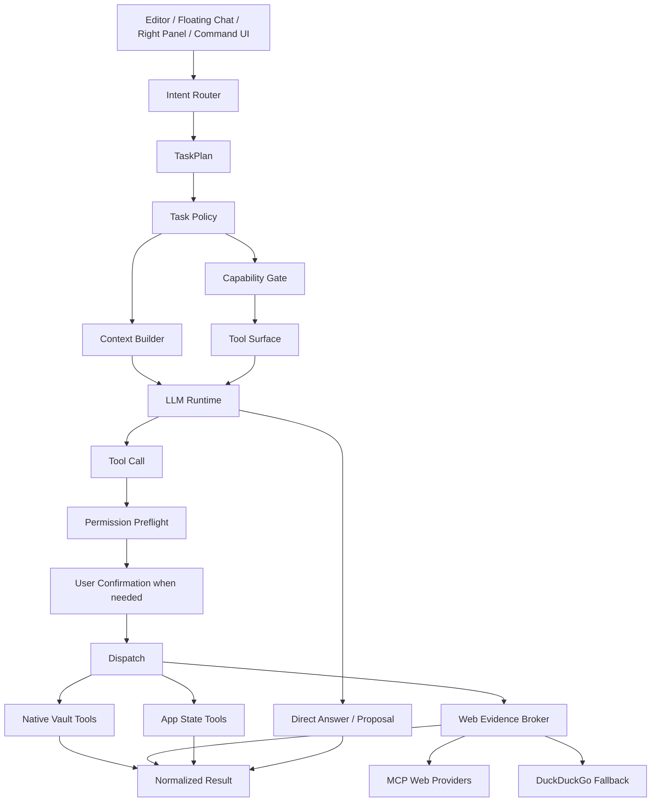

# Iris AI Harness Architecture Design Spec

日期：2026-07-01
状态：Ready for implementation review
范围：Iris 普通 AI harness、联网证据、MCP provider、编辑区 AI、权限/工具调度、会话生命周期

## 1. 背景与目标

Iris 现在的 AI harness 不是缺少能力，而是概念层叠过多：旧 scene、前端 TaskPlan、Rust AgentIntent、ToolPolicy、MCP runtime、WebEvidenceBroker、写入确认和研究 artifact 都在发挥作用，但边界没有完全收敛。这导致两个用户可见问题：简单问题被误判成“综合研究”，联网后端/Provider 状态不可解释；同时也带来长期架构风险：MCP 容易被误做成通用工具平台，MiniMax 这类历史捷径容易继续占据联网后端语义。

本设计目标是把 Iris AI harness 收敛为一条可解释、可测试、可审计的链路：

```text
User / Editor Context
  -> Intent Router
  -> TaskPlan
  -> Task Policy
  -> Context Builder
  -> Capability Gate
  -> Tool Surface
  -> LLM Runtime
  -> Permission Preflight
  -> Dispatch
  -> Provider / Native Runtime
  -> Normalized Result
```

这不是推倒重来。以下基础应保留并强化：

- MCP runtime、MCP host runtime、MCP web provider registry。
- WebEvidenceBroker。
- ToolPolicy、AgentTaskPolicy、Permission preflight。
- Native vault dispatch、写入确认、版本快照、回收站、索引刷新。
- Session、trace、pending confirmation、resume、cancel 生命周期。
- 已有 MiniMax 普通 LLM provider 配置能力。

真正要清理的是：

- 用户可见的“智能场景路由”心智。
- 字符串关键词把短答升级为研究的行为。
- MiniMax 作为联网证据后端的历史捷径。
- 任意 MCP tools 自动进入 LLM 工具面的平台化幻觉。
- 依赖源码字符串的空转测试。

## 2. 核心决策

### 2.1 MiniMax 退回普通 LLM provider

MiniMax 不再作为 web evidence backend。它只保留普通 LLM provider 身份，用于模型调用、模型路由和模型配置。

联网证据目标顺序固定为：

```text
enabled MCP web providers -> DuckDuckGo native fallback
```

MiniMax 不应出现在：

- WebEvidenceBroker search/fetch candidate。
- 管理中心“联网后端/联网证据”状态。
- MCP provider 诊断的 fallback 序列。
- 普通 evidence packet 的 provider 可见说明。

### 2.2 MCP 是 capability provider，不是通用工具平台

Iris 不采用 opencode 式“配置本地 MCP 后把 tools 全部暴露给模型”的架构。原因是 Iris 的核心对象是用户 Markdown 知识库，文件写入必须经过 vault 边界、版本快照、回收站、索引刷新和用户确认。任意 MCP file/process/secret tool 直通会绕过这些边界。

MCP 在 Iris 的目标定位：

- 作为显式映射的 capability provider。
- 当前正式 capability 只开放 `web.search` 和 `web.fetch`。
- `tools/list` 可用于诊断、配置辅助、测试连接，但不能自动转换为 LLM tool surface。
- 未来新增 capability 必须先补权限模型、UI 说明、审计语义和测试。

### 2.3 Intent Router 只判断任务，不授权工具

Intent Router 不决定 provider、不执行工具、不授予权限。它只把当前请求归纳成 TaskPlan 事实。

TaskPlan 是每轮请求的事实摘要，不是长期 session 模式。上一轮是 research，下一轮也不能自动继承 research。

### 2.4 Router 采用结构化优先、LLM 辅助的混合方案

Iris 不应继续依赖散落的关键词字符串把请求机械地塞进四类“场景”。但也不能把路由、权限或工具授权完全交给 LLM 自行决定。目标实现是混合 router：

- UI action、编辑器选区、pending confirmation、图片输入、显式命令等结构化信号优先，必须确定性处理。
- “是否需要新鲜联网事实”“是否明确要求多源研究”等语义判断可以使用集中式规则，并允许未来接入轻量 LLM classifier 作为低置信度建议。
- LLM classifier 的输出只能写入 TaskPlan 候选字段，不能直接打开工具、不能选择 provider、不能绕过 confirmation。
- Task Policy 和 Capability Gate 才是最终授权层；它们只接受白名单 capability 和明确 policy，而不是自然语言标签。
- 路由结果必须可测试、可解释、可回放；每轮请求重新生成 TaskPlan，不继承上一轮 research 模式。

这让 Iris 获得 LLM 语义判断的弹性，同时保留桌面知识库应用必须有的确定性、安全边界和可审计性。

### 2.5 新鲜事实不等于研究

“最新”“现在”“价格”“新闻”“哪一年修订”等只说明可能需要 fresh web evidence，不说明用户要研究报告。短答查证必须保持 `direct_answer`，只有明确要求“研究、综述、多来源对比、系统考察、报告、证据矩阵”时才进入 research。

### 2.6 编辑器是一等入口

选区翻译、扩写、缩写、润色、替换、插入和悬浮聊天都必须走同一套 ContextReference -> TaskPlan -> Policy -> Permission -> Dispatch 链路。不能因为文本里出现“最新/研究/依据”就抢到 research，也不能把长选区无边界塞进 prompt 或缓存。

## 3. 目标架构



## 4. Intent 与 TaskPlan

### 4.1 目标 intent

- `short_answer` / 兼容 `chat`：默认短答、普通对话、事实问答。
- `ask_notes`：用户明确要求基于当前笔记、选区、资料库回答。
- `rewrite_selection`：翻译、缩写、扩写、润色、改写选区。
- `write` / 兼容 `creative_write`：续写、插入、补写、生成候选内容。
- `organize`：标题、标签、分类、移动、链接建议。
- `citation_check`：引用、出处、证据支撑核查。
- `document_check`：整篇/章节结构、风格、引用缺口检查。
- `research`：明确多源研究、综述、系统考察、证据矩阵。
- `vision_chat`：图片相关对话。
- `skill_management`：prompt-only Skill 创建、确认、管理。

### 4.2 路由优先级

路由顺序必须稳定：

1. UI action。
2. 图片。
3. Skill 管理。
4. pending write confirmation。
5. 选区翻译/改写/扩写/缩写。
6. 明确写入或插入当前笔记。
7. 文档/章节/引用动作。
8. 明确 research/deep work。
9. fresh external fact 短答查证。
10. organize。
11. ask_notes。
12. chat。

### 4.3 过渡期 TaskPlan 字段

保留现有字段，同时补充新语义字段，避免 intent 过载：

```ts
export type EvidenceNeed = "none" | "fresh_web" | "multi_source_research";
export type ContextNeed =
  | "none"
  | "current_reference"
  | "vault_search"
  | "long_document";
export type OperationKind =
  | "answer"
  | "patch"
  | "create"
  | "organize"
  | "diagnose";
export type OutputShape = "chat" | "confirmation" | "artifact" | "diagnostic";

export interface TaskPlan {
  intent: TaskPlanIntent;
  confidence: TaskPlanConfidence;
  evidenceNeed?: EvidenceNeed;
  contextNeed?: ContextNeed;
  operationKind?: OperationKind;
  outputShape?: OutputShape;
  contextReferences: ContextReference[];
  retrievalMode: RetrievalMode;
  webMode: WebMode;
  modelSlot: CapabilitySlot;
  executionMode: ExecutionMode;
  outputMode: OutputMode;
  artifactPlan: ArtifactPlanItem[];
  requiresClarification: boolean;
  clarificationQuestion?: string | null;
  sourceHints: string[];
}
```

## 5. Task Policy 与 Capability Gate

Task Policy 从 TaskPlan 派生：模型槽位、轮数、token budget、上下文策略、联网许可、工具可见性。Policy 不信任 LLM，也不信任 MCP 自报 schema。

原则：

- `chat + evidenceNeed:fresh_web` 可联网短答，不生成 research artifact。
- `research` 才获得更高轮数、更大 evidence budget、更深 evidence artifact。
- `rewrite_selection` 和 `write` 可暴露写入候选/patch 工具，但写入必须确认。
- `research` 默认不获得 vault 写权限。
- legacy scene 只用于旧 session/trace/IPC 兼容，不作为核心策略输入。

稳定 capability vocabulary：

- `vault.read`
- `vault.search`
- `vault.write.patch`
- `vault.create_note`
- `vault.rename_move`
- `vault.delete_to_trash`
- `vault.versioning`
- `web.search`
- `web.fetch`
- `app_state.read`
- `app_state.write`

当前 MCP 只允许映射 `web.search` / `web.fetch`。

## 6. Web Evidence Broker

Broker 是唯一联网语义层。所有联网证据都必须进入 broker；模型厂商内置联网、native search、MCP search/fetch 都不能绕过 broker 直接注入 prompt。

Broker 责任：

- 查询规划和 URL 深读。
- provider 选择、fallback、失败分类。
- search/fetch 结果归一化。
- canonical URL 去重。
- 冲突标记，不自动裁判。
- evidence packet 生成。
- cache 隔离。
- provider 诊断和可解释性。

Provider 顺序：

```text
1. enabled MCP providers with explicit web.search / web.fetch mapping
2. DuckDuckGo native fallback
```

当 MCP 失败时继续 DDG；当 DDG 也失败时返回分类失败，不把 provider raw response 暴露给普通 UI。

## 7. MCP Provider 配置目标

管理中心应让 AnySearch、Jina、Firecrawl、Tavily、Brave Search、SearXNG 等 search/fetch MCP 服务以傻瓜式预设配置接入，但最终落到统一字段：

- Provider name。
- Transport kind：HTTPS / stdio。
- HTTPS config：`url`、`allow_localhost_dev`。
- stdio config：`command`、`args`。
- Credential refs：只保存 OS credential service ref、header/env 名称和 bearer scheme，不保存明文 secret。
- Search mapping：tool name、query arg、max result arg、extra args。
- Fetch mapping：tool name、url arg/url list arg、max chars arg、extra args。

UI 原则：

- 只保留一个预设入口：卡片内“快速预设”下拉。
- 顶部只显示标题、说明、添加按钮，不重复渲染六张预设卡或按钮矩阵。
- 诊断区显示 mapping 完整性、transport 校验、凭据缺失、最近失败分类、调度可用性。
- “测试连接”才做 live probe。

## 8. Native Vault 写入边界

opencode 的本地 MCP 文件操作模式值得参考其“工具协议化”和“可组合调度”思想，但不能照搬到 Iris。Iris 的核心资产是用户 Markdown 知识库，文件增删改查不仅是 filesystem CRUD，还牵涉笔记合法 UTF-8、版本快照、回收站、索引刷新、链接影响、Skill scope 和用户确认。把本地 MCP file tools 直接暴露给模型，会绕过这些产品级不变量。

文件修改不交给 MCP。所有 Markdown 正文写入继续走 native vault tools：

- patch 必须带 `base_content_hash` 和 range。
- 写入前校验 vault path、Skill scope、保留目录和分类边界。
- 写入前创建版本快照。
- 删除进入回收站，不永久删除。
- 写入后刷新索引。
- 所有写入工具必须 confirmation-gated。

这不是技术债，是 Iris 的产品核心。

## 9. 编辑区集成

### 9.1 选区命令

```text
ContextReference(selection)
  -> TaskPlan(intent=rewrite_selection, operationKind=patch)
  -> writer model slot
  -> patch proposal
  -> confirmation card
  -> native vault patch dispatch
```

不得走 research，不得直接写文件，不得绕过 base hash。

### 9.2 悬浮聊天框

悬浮聊天框携带轻量 ContextReference，而不是把长选区作为普通用户输入粘贴：

- note path。
- editor range。
- UTF-8 range。
- content hash。
- short excerpt。
- heading path。
- stale flag。

如果用户选择“替换选区”，进入 patch confirmation；如果选择“插入到后方”，目标 range 明确为光标或选区后方。

### 9.3 右侧对话面板

右侧普通聊天可以引用当前笔记/选区，但默认短答。当前 session 中上一轮是 research，不得锁定下一轮仍为 research。

## 10. 会话、生命周期与隔离

必须保持：

- session messages 按会话隔离。
- trace/task events 按 request/session 关联。
- pending confirmation 不跨会话执行。
- resume 只恢复同一个 task/tool confirmation。
- cancel 不影响其他 session。
- provider circuit breaker 是 provider 运行态，不污染 session 内容。
- TaskPlan、Policy、provider choice 可作为 trace 元数据记录，但不得包含正文和 secret。

会话切换时，未确认写入必须保持待确认或明确失效，不得静默写入当前打开文档。

## 11. LLM 输入输出与缓存策略

不缓存：

- 完整 prompt。
- 用户笔记正文。
- 选区正文。
- clipboard body。
- MCP headers。
- API key/token/password/cookie。
- 完整 query。
- 完整 URL。
- 完整网页正文。

可保存/缓存：

- 当前 session 的 assistant message。
- 当前 session artifact。
- TaskPlan 安全摘要。
- Policy 安全摘要。
- provider id/kind/config hash。
- evidence hash。
- safe URL/domain 或 URL hash。
- 工具结果摘要。
- 失败类别。
- Web cache 中经过 TTL/LRU 管理的外部网页摘要/正文，key 必须包含 vault/provider/config/broker version 隔离字段。

除非未来单独设计隐私策略和用户开关，否则不做跨会话 prompt-response 复用。

## 12. 普通 UI 与诊断 UI

普通用户 UI：

- 不显示“智能场景路由”作为主概念。
- 普通回答不显示 TaskPlan 标签。
- 联网短答显示低干扰状态：已联网查证、provider、来源数量。
- 研究任务才显示研究进度或 evidence artifact。
- 证据详情只显示 title、safe URL/domain、citation、excerpt、retrieval reason、conflict。

诊断 UI：

- 管理中心显示 MCP providers、DDG fallback、实际 provider 顺序、最近失败原因、mapping 完整性。
- MiniMax 只出现在模型 provider/LLM 设置中，不出现在联网后端。
- TaskPlan/Policy/tool surface 可在开发/诊断视图查看。

## 13. 非目标

- 不把 Iris 做成通用 Agent/plugin 平台。
- 不采用 opencode 式 MCP tools 自动暴露模型工具箱。
- 不用 MCP 替代 native vault 文件写入。
- 不新增本地 filesystem MCP CRUD。
- 不新增依赖，除非单独论证许可证、必要性和替代方案。
- 不新增独立 Web Evidence 工作台。
- 不缓存完整 prompt-response 用于跨会话复用。

## 14. 质量属性

- 可解释：用户能在管理中心看懂“当前联网为什么优先 MCP、何时退到 DDG”。
- 可测试：路由、provider 顺序、capability allowlist、写入确认、会话隔离和证据隐私都必须有行为测试或合同测试。
- 可演进：新增 capability 先扩展 policy/permission/audit/UI，再接 provider，不从 MCP tools/list 自动渗透。
- 可恢复：写入失败、provider 熔断、session 切换、cancel/resume 都保持局部影响，不污染其他会话或笔记。
- 隐私最小化：trace/cache/audit 只保存安全摘要、hash、分类和可解释状态，不保存完整 prompt、正文、secret 或 raw provider payload。

## 15. 验收标准

- “最新的刑法是哪一年修订的？”联网开启时短答查证，不生成研究综述。
- 同一问题联网关闭时仍短答，不追问是否联网。
- 明确“研究综述/多来源对比/系统考察”才进入 research。
- MiniMax 不再作为 web evidence backend。
- MCP provider 可证明实际参与 search/fetch。
- DDG 是唯一 native fallback。
- AnySearch 等 MCP 预设配置可保存、诊断、测试连接。
- 选区翻译/扩写/缩写进入 rewrite + confirmation。
- 写入不串会话、不误写、不绕过确认。
- MCP 任意 tool 不进入 LLM 普通工具面。
- 证据详情不泄露 provider raw fields。
- Rust fmt/clippy/test 与前端 lint/format/typecheck/test 通过。
