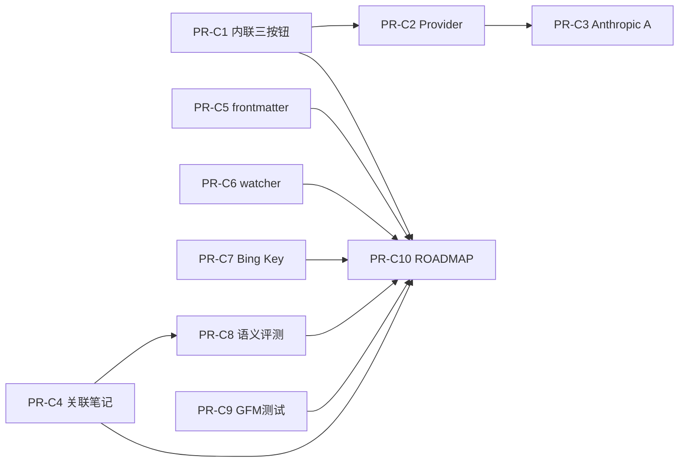

# v0.1.0 补齐 PR 清单

> **状态**：PR-C1～C10 **已全部合并**（v0.1.0 于 2026-05-25 发布）。  
> **文档索引**：[docs/README.md](./README.md)  
> **后续工作**：体验纸墨化、API Base URL、E2E → [v0.1.1-epic.md](./v0.1.1-epic.md) / [ROADMAP § v0.1.1](../ROADMAP.md#v011--体验定稿与质量补齐)

本文档记录 **初版脚手架合并之后**，为达到 [ROADMAP.md](../ROADMAP.md) 中 v0.1.0「核心功能 + 验收标准」所需的最小 PR 切片（**历史审计 + 证据索引**，新排期勿改本表结构）。

- **初版施工切片**（地基 → 编辑器 → AI → 搜索）：见 [v0.1.0-epic.md](./v0.1.0-epic.md)
- **差距审计**（2026-05）：初版约 60–70% 可演示 MVP；下列 PR 用于闭合缺口 → **已完成**

## 原则

- 每个 PR 独立可合并，并通过：
  - `cargo fmt --check` / `cargo clippy --all-targets -- -D warnings` / `cargo test`
  - `npm run typecheck` / `npm run lint` / `npm run test`
- 修改 `#[tauri::command]` 时同步：`src-tauri` → [src/types/ipc.ts](../src/types/ipc.ts) → [src/lib/ipc.ts](../src/lib/ipc.ts)
- **v0.1 标签策略**：仅索引 YAML frontmatter 中的 `tags`；正文 `#tag` 推迟至 v0.2（见 ROADMAP v0.2 标签系统）

## 已确认的产品/技术决策

| 议题         | 决策                                                                                                               |
| ------------ | ------------------------------------------------------------------------------------------------------------------ |
| PR3 多提供商 | **方案 A**：Anthropic 走 Messages API + 流式解析（非仅 OpenAI 兼容 endpoint）                                      |
| PR5 标签来源 | **仅 frontmatter `tags`**，不做正文 `#tag` 扫描                                                                    |
| 语义向量存储 | v0.1 使用 `fastembed` + `chunk_embeddings` BLOB + Rust 余弦；**非** sqlite-vec 虚拟表（PR8 文档对齐 ROADMAP 表述） |

---

## PR 清单

### PR-C1 — `fix(ai): 内联 AI 接受 / 重试 / 回退`

**阻塞验收**：内联 AI 的接受/重试/回退操作正常工作

| 项   | 内容                                                                                                                                           |
| ---- | ---------------------------------------------------------------------------------------------------------------------------------------------- |
| 范围 | `AiNodeView.tsx`、`AiStreamExtension.ts`、`App.tsx`（`runInlineAi`）                                                                           |
| 实现 | **接受**：保留生成内容并合并为正文段落；**回退**：恢复触发前选区原文（快照）；**重试**：同一 prompt 重新 `llm_generate` 并流式更新 `ai-stream` |
| 测试 | Vitest：三按钮分别触发不同逻辑（mock IPC）                                                                                                     |
| Done | 重试 ≠ `rejectAiStream`；回退 ≠ 删除节点                                                                                                       |

---

### PR-C2 — `fix(ai): 内联与 / 命令使用当前 Provider`

**阻塞**：多提供商（UI 选择与内联一致）

| 项   | 内容                                                                                               |
| ---- | -------------------------------------------------------------------------------------------------- |
| 范围 | `App.tsx`、`AiPanel.tsx`（共享 provider 状态或轻量 context）                                       |
| 实现 | 内联 AI、`/` 命令不再写死 `openai`；与侧栏当前 provider 一致；`/` 可选将结果写入编辑器 `ai-stream` |
| Done | 切换 Ollama/自定义后，内联与 `/` 使用同一 provider                                                 |

**依赖**：PR-C1（可选，建议先 C1）

---

### PR-C3 — `fix(llm): Anthropic Messages API 适配`（方案 A）

| 项   | 内容                                                                              |
| ---- | --------------------------------------------------------------------------------- |
| 范围 | `src-tauri/src/llm/engine.rs`、必要时 `providers.rs`                              |
| 实现 | `provider == "anthropic"` 时走 Anthropic Messages + 流式；OpenAI 兼容路径保持不变 |
| Done | Claude API Key + 简单对话/流式可通                                                |

**依赖**：PR-C2

---

### PR-C4 — `feat(ai): 上下文面板注入关联笔记（语义 Top-K）`

**阻塞**：上下文问答基于当前笔记和**关联笔记**

| 项   | 内容                                                                                              |
| ---- | ------------------------------------------------------------------------------------------------- |
| 范围 | `AiPanel.tsx`、复用 `search_semantic` IPC                                                         |
| 实现 | 提问前对 vault 做语义 Top 3–5（**排除当前文件**），拼入 system/context；保留当前笔记全文 + 引用卡 |
| Done | 面板或日志可证关联片段；无结果时降级为仅当前笔记                                                  |

---

### PR-C5 — `feat(storage): frontmatter 与 tags 索引`

**阻塞**：SQLite 元数据含 frontmatter、标签

| 项     | 内容                                                                    |
| ------ | ----------------------------------------------------------------------- |
| 范围   | `src-tauri/src/indexer/`（`frontmatter.rs` + `scan.rs`）                |
| 实现   | 解析 `---` YAML；`files.frontmatter` 存 JSON；`tags` / `file_tags` 同步 |
| 约定   | 仅 `tags` 键（数组或标量）；`title` 覆盖可选（PR 内写明）               |
| 测试   | Rust：有/无 frontmatter、改 tags、删文件级联                            |
| 非目标 | 正文 `#tag`、标签聚合 UI                                                |

**Issue 模板**：见本文档附录 A。

---

### PR-C6 — `fix(storage): vault 切换后重启文件监听`

| 项   | 内容                                           |
| ---- | ---------------------------------------------- |
| 范围 | `vault_set`、`lib.rs`、`watcher/mod.rs`        |
| 实现 | `vault_set` 成功后重建 `FileWatcher`           |
| Done | 首次选择笔记目录后无需重启应用即可检测外部修改 |

---

### PR-C7 — `feat(settings): Bing 搜索 API Key 凭据 UI`

**阻塞**：LLM Key + 搜索 API Key；联网搜索 Bing 路径

| 项   | 内容                                                               |
| ---- | ------------------------------------------------------------------ |
| 范围 | `AiPanel` 或轻量设置区、`credential_*` IPC                         |
| 实现 | UI 写入 `iris/bing-search`（keyring）；说明未配置时降级 DuckDuckGo |
| Done | 配置 Bing Key 后走 Bing API；无 Key 仍可用 DuckDuckGo              |

---

### PR-C8 — `docs(search): 语义检索说明 + Recall@5 评测`

**阻塞**：语义 Top-5 可用（验收）；ROADMAP「sqlite-vec」表述

| 项   | 内容                                                                                                  |
| ---- | ----------------------------------------------------------------------------------------------------- |
| 范围 | `ROADMAP.md` 或 `ARCHITECTURE.md` 其一、`docs/eval/semantic-search.md`                                |
| 实现 | 写明 v0.1 实现路径（fastembed + BLOB + 余弦）；填入 ≥20 条查询评测表，Recall@5 ≥ 0.6 或记录未达标原因 |
| Done | PR 附评测表；可选 `#[ignore]` 集成测试骨架                                                            |

**依赖**：PR-C4 完成后评测更有意义（可并行若评测集独立）

---

### PR-C9 — `test(editor): GFM round-trip 扩充`（可选，支撑编辑器勾选）

| 项   | 内容                                                   |
| ---- | ------------------------------------------------------ |
| 范围 | `tests/markdown_roundtrip.test.ts`、必要时 TipTap 扩展 |
| 实现 | 增补粗体/链接等；schema 注释列明不支持语法             |
| Done | CI 全绿；ROADMAP 表述为「核心 GFM」而非「完整」        |

---

### PR-C10 — `docs(roadmap): v0.1.0 勾选与发布说明`

**应最后合并**

| 项   | 内容                                             |
| ---- | ------------------------------------------------ |
| 范围 | `ROADMAP.md`、`CHANGELOG.md`                     |
| 实现 | 仅勾选已验收项；未闭合项保持 `[ ]` 或移至 v0.1.1 |
| Done | 勾选与 PR-C1～C9 证据一致                        |

---

## 合并顺序



**建议批次**

1. **验收硬门槛**：C1 → C2 → C3 → C4 → C6 → C7 → C8
2. **索引与发布**：C5 → C9（可选）→ C10

---

## 刻意不纳入本清单（已移至路线图版本）

| 项                            | 归属版本           | 说明                                          |
| ----------------------------- | ------------------ | --------------------------------------------- |
| sqlite-vec 虚拟表             | **v0.2**           | PR-C8 文档对齐；实现见 ROADMAP 语义检索升级   |
| 正文 `#tag` 索引与聚合        | **v0.2**           | 标签系统                                      |
| 完整 GFM（脚注、数学公式等）  | 非 v0.1 硬门槛     | PR-C9 定义为「核心 GFM」                      |
| 纸墨 UI、AI 侧栏收起          | **v0.1.1**         | [design-system.md](./design-system.md) 阶段 0 |
| 自定义 API base URL 表单      | **v0.1.1**         | IPC 已预留 `custom_base_url`                  |
| Playwright 全链路 E2E         | **v0.1.1**（可选） | v0.1 以 Vitest 占位 + 手工验收                |
| 第三方插件 / 移动端 / CRDT 等 | **永久非目标**     | ROADMAP「产品原则与非目标」                   |

---

## 发版前复检清单（v0.1.0 已执行）

- [x] ROADMAP 五条验收标准各有演示步骤或测试/文档证据
- [x] `npm run tauri dev` / `pnpm tauri dev`：选目录 → CRUD → 外部改文件 → 提示重载
- [x] 内联 AI：接受 / 重试 / 回退各测一次
- [x] AiPanel：提问可见关联笔记上下文
- [x] 语义搜索：Top-5 评测记录（`docs/eval/semantic-search.md`）
- [x] 笔记目录、SQLite、日志无 API Key 明文
- [x] `cargo clippy -D warnings` 与前端 lint/typecheck/test 全绿

> v0.1.1 复检项见 [v0.1.1-epic.md](./v0.1.1-epic.md)。

---

## 附录 A — PR-C5 Issue 摘要（frontmatter/tags）

**标题**：`feat(storage): 索引 YAML frontmatter 与 tags（v0.1 不含正文 #tag）`

**非目标**：正文 `#tag`、标签 UI、双向链接。

**frontmatter 示例**：

```yaml
---
title: 会议记录
tags: [工作, iris]
---
```

**验收**：`files.frontmatter` 非 NULL；`file_tags` 正确；`cargo test` 通过；PR 注明 `#tag` 在 v0.2。

---

## 附录 B — 与初版 Epic PR 的对应关系

| 初版 Epic #    | 主题             | 状态                     |
| -------------- | ---------------- | ------------------------ |
| 1              | 文件导航文档     | 已做                     |
| 2–14           | 脚手架～E2E 占位 | 已做（见仓库）           |
| **PR-C1～C10** | 本清单           | **已完成**（2026-05-25） |

维护说明：

- v0.1.0 功能补齐：**冻结**本表，仅作历史与证据索引。
- 新排期、体验与质量项：只改 [ROADMAP.md](../ROADMAP.md) 与 [v0.1.1-epic.md](./v0.1.1-epic.md)。
- 产品/体验边界变更：ROADMAP「产品原则」+ [design-system.md](./design-system.md)。
